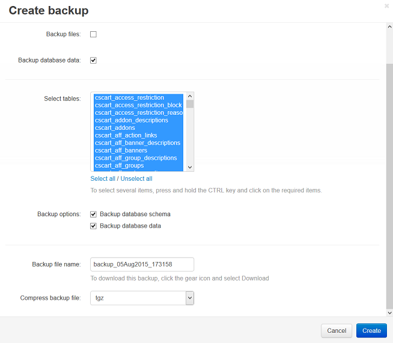

******************************************
How To: Back up the Database of Your Store
******************************************

.. note:: 

    **Tutorial Difficulty: 1 / 3**

Follow the instructions to make a full backup of the store database:

.. note::

    Database backup can also be referred to as *database dump*.

1. In the administration panel of your store.

2. Go to **Administration → Backup/Restore**.

3. Click the **+ button**.

4. Specify the parameters of the backup:

   * **Backup files**—tick this checkbox, if you want the backup to include the files of your store. Otherwise it will only include the SQL file with the database dump.

   .. note::

       Some information, like images, is stored in various folders of your CS-Cart/Multi-Vendor installation. If you want to fully back up your store, make sure to back up the files.

   * **Extra folders**—choose additional directories to be included in the backup.

   * **Backup database data**—if ticked, the backup will include the database data proper. Normally, this option should be enabled, unless you have a reason to do otherwise.

   * **Select tables**—list of the database tables to be included in the backup. The tables with the ``cscart`` prefix are selected in the list by default. To select multiple entries, press and hold the **CTRL** or **SHIFT** key.

   * **Backup database schema**—if ticked, the backup includes the structure of the database tables. Normally, this option should be enabled, unless you have reason to do otherwise.

   * **Backup file name**—name of the archive that contains the database dump.

5. Click the **Create** button.

The system will display the progress of the database dump creation. When the process is complete, there will be a new backup file on the list under **Administration → Backup/Restore**. You can download the backup file to your local machine by clicking the backup name or pressing the **gear button** of the corresponding backup and choosing **Download**.

.. note::

    Backup files displayed on the **Backup/Restore** page are located in the *var/backups* directory of your CS-Cart installation. 
