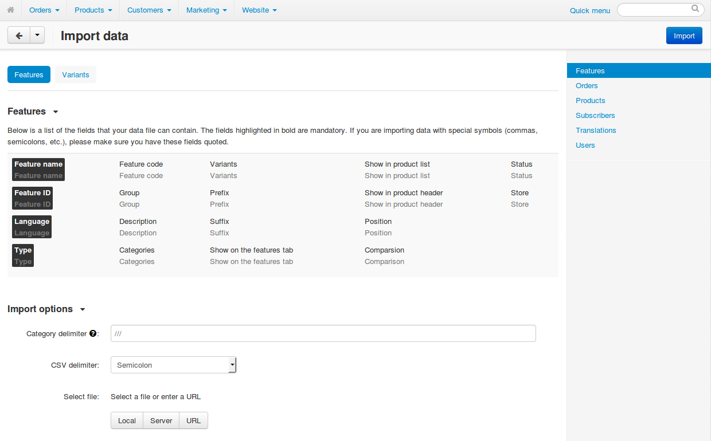
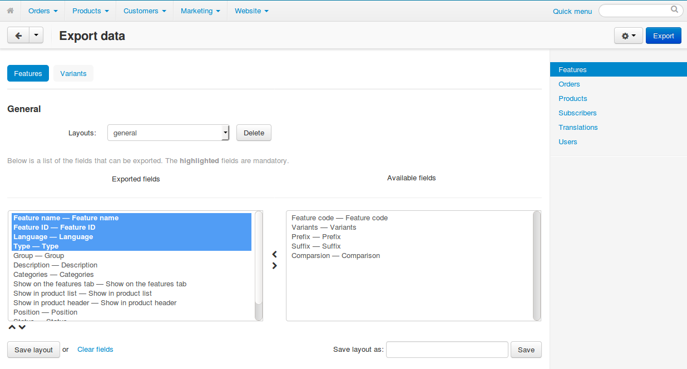

***********************
About Import and Export
***********************

To import or export data (such as products, orders, options, etc.), go to **Administration → Import data** or **Administration → Export data** respectively.

==========
Data Types
==========

For convenience, the import and export pages split the data into types (see the menu on the right):

* **Features**—product features;

* **Orders**—order details;

  .. important::

      You can only update order details—adding new records is not supported.

* **Products**—product details;

* **Subscribers**—mailing list subscribers;

* **Translations**—language variables;

* **Users**—user profiles.

.. note::

    Starting with version 4.4.1, Multi-Vendor allows you to export and import :doc:`vendors <../users/vendors/index>`.

.. image:: img/data_subsections.png
    :align: center
    :alt: Switch between the types of data you want to import or export by using the menu on the right.

======
Import
======

Every data type may include several tabs. Each tab includes two areas: 

* The upper area contains the list of fields that the imported CSV file can include. Mandatory fields are highlighted. 

* The lower area contains the import settings. These settings may vary depending on the type of the imported data.

======
Export
======

The content of an exported CSV file is determined by two list boxes:

* **Exported fields**—the fields that will be included in the exported CSV file as separate columns.

* **Available fields**—the fields that won't appear in the exported CSV file, unless you add them to the list of exported fields

To move fields from one list to another, use the twin horizontal arrows between the lists. To change the order of fields in the **Exported fields** list, use the twin vertical arrows below the list box. The highlighted fields on the **Exported fields** list are mandatory and thus cannot be removed from the list.

.. hint::

    If you export data regularly, you can save the list of the exported fields: enter the name of your export pattern in the **Save layout as** field and click **Save**. Then you'll be able to select your layout in the **Layout** drop-down list.

--------------
Export Options
--------------

This is the list of all export settings. Some of them appear only in specific subsections.

* **Language**—the languages that will be exported to the CSV file.

* **Category delimiter**—the delimiter to separate child and parent categories.

* **CSV delimiter**—the column delimiter that will be used in the exported CSV file.

* **File name**—the name of the exported file.

* **Files directory**—the directory where files for downloadable products are located. Used for files without a path specified.

* **Images directory**—the directory where images are located. Used for images without a path specified.

* **Output**—the way the CSV file will be presented:

  * *Direct download*—you'll be offered to download the CSV file.

  * *Screen*—the CSV file will be opened in your browser.

  * *Server*—the CSV file will be saved on the server where your CS-Cart/Multi-Vendor is installed.

  .. important::

      Regardless of the output type, you can download the file later: go to **Administration → Export data**, click the **gear** button, and choose **Exported files**.

* **Feature variants delimiter**—the delimiter that will separate the feature variants in the exported CSV file.

* **Price decimal separator**—the symbol that will separate the integer part from the fractional part in product prices in the exported CSV file.

.. image:: img/export_options.png
    :align: center
    :alt: Export options are different for different data types.

.. hint ::

    We have several dedicated articles about :doc:`importing and exporting products </user_guide/manage_products/import_export/index>`.
