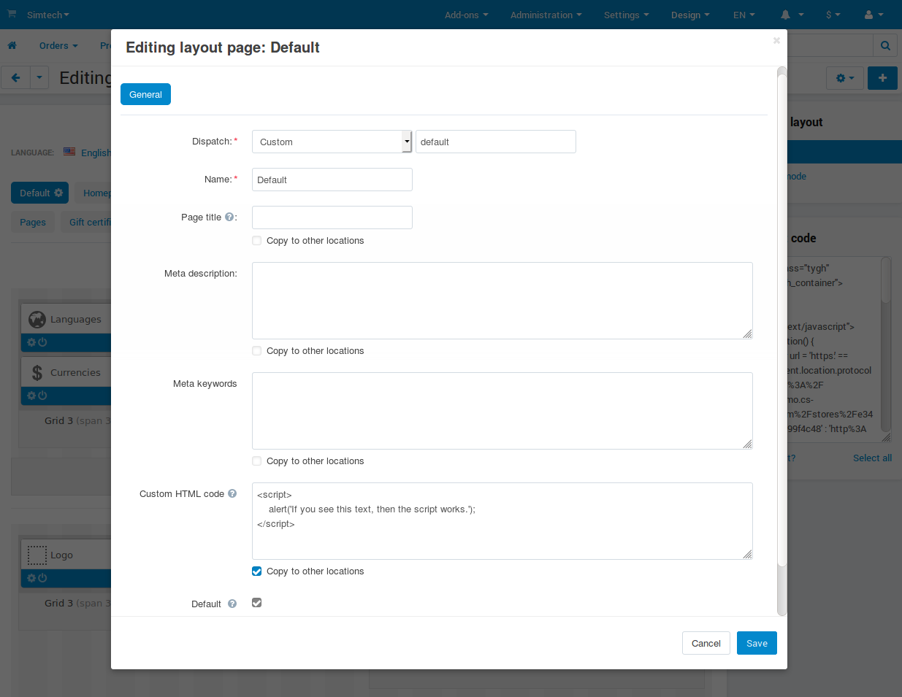

*********************************************************************
How To: Add Custom Code or Script to Page in CS-Cart and Multi-Vendor
*********************************************************************

Sometimes you need to add JavaScript or some other code from a third-party service (for example, to add an online chat to the site). CS-Cart and Multi-Vendor allow you to do it without modifying files, via :doc:`blocks </user_guide/look_and_feel/layouts/blocks/index>`.

This article will explain how to add some code to a page of your store. We'll cover one example and explain what to do in other cases.

-----

**For example, we need to add the following code to ALL pages of the site:**

.. code-block:: html

    

This code is perfect for for experiments—when you come to the page, you'll immediately see if the code works. That way you can check which pages have the code, and which don't. However, it's best to try this particular script at the `demo site <https://demo.cs-cart.com>`_ or a test installation—a pop-up at every page distracts people from making purchases.

.. contents::
   :backlinks: none
   :local:

=====================================================
Adding Code to <Body> or Particular Place of the Page
=====================================================

#. Disable WYSIWYG editors. They are convenient for writing blog articles or product descriptions, but can remove the "unnecessary bits" of the code and break it. Even if you switch to the source code editing mode (usually it's the **<>** button in the editor), the code can get broken next time you edit and save the block.

   .. note::

       Go to **Settings → Appearance**, set **Default WYSIWYG editor** to *Do not use*, and save your changes.

#. :doc:`Create a new block </user_guide/look_and_feel/layouts/blocks/actions_on_blocks>`. You can place blocks on different :doc:`layout pages </user_guide/look_and_feel/layouts/layout_pages/index>` (home page, product pages, blog articles, etc.). The choice depends on where you need to add the code.

   * **In our case** we need to add the code to all pages. The easiest way is to do it on the default layout page. If you add a block to *Top panel*, *Header*, or better yet, to *Footer* (because it doesn't have any blocks by default), the code will be added everywhere.

     But not all layout pages use *Top panel*, *Header*, and *Footer* from the default layout page. For example, the checkout page has only *Content*, and all other blocks are removed by default. Your store might have other layout pages like this. Add the block to these layout pages as well.

   * **There are other cases**, when you need the code on all product pages or blog articles. Then you need to select the corresponding layout page (for example, "Products") and add the block there. If you only need the block for a particular product, it's best to disable it by default. You'll enable it for a product on the **Layout** tab of the product editing page.

#. When you create a new block, you have to select its type. There are two types of blocks for adding code:

   * *HTML block* is enough in most cases. It supports texts or the scripts like JavaScript from the beginning of this article. That's the block we recommend, and it's the only option available to vendors in Multi-Vendor (:doc:`assuming they can edit layouts </user_guide/users/vendors/allow_vendors_to_edit_layout_and_theme>`).

   * *HTML block with Smarty support* comes in handy when you need to receive some data from CS-Cart or Multi-Vendor with functions.

     .. important::

         If you add the code into the block with Smarty support, and the code includes ``{`` or ``}``, then surround the code with the following tags: ``{literal}...{/literal}``.

#. Add your code to the **Content** tab and save your changes. Note that the content is language-dependent:

   * When you create block, its content will be copied to all the languages you have.

   * If you edit the existing block later to change the code, make sure to tick the **Apply to all languages** checkbox on the **Content** tab. Otherwise the content will depend on the language selected by the customer.

     .. image:: img/apply_to_all_languages.png
         :align: center
         :alt: An existing block has the checkbox on the "Content" tab. It determines whether or not to apply the changes to other languages.

#. (optional) CS-Cart and Multi-Vendor move scripts to the end of the page code. The script from this article triggers a browser pop-up which doesn't depend on the position of the script in the page code. However, if you're adding an object (such as map or banner), you may find it at the bottom of the page, and not where the block is.

   To show everything where it's meant to appear, and to prevent the script from being moved to the end of the page, add the ``data-no-defer`` microformat. Here is how it looks with our code:

   .. code-block:: html

       

=====================
Adding Code to <Head>
=====================

Sometimes the code needs to be added to ``<head>...</head>``. This is done :doc:`in the settings of layout pages </user_guide/look_and_feel/layouts/layout_pages/index>`, in the **Custom HTML code** field. The layout pages where you add the code determine which pages of your store will have that code.

If you're adding the code to the default layout page, you'll see the **Copy to other locations** checkbox. If you tick it, you'll be able to add the code to all the pages of your site quickly, without going through every layout page.

.. note::

    The code in ``<head>...</head>`` doesn't depend on the language selected by the customer.

