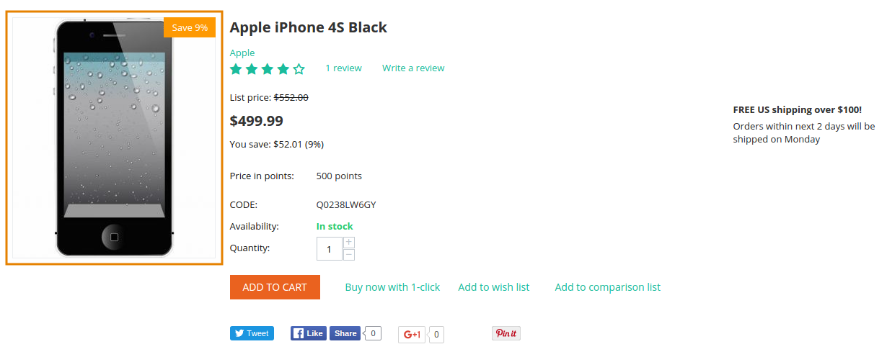
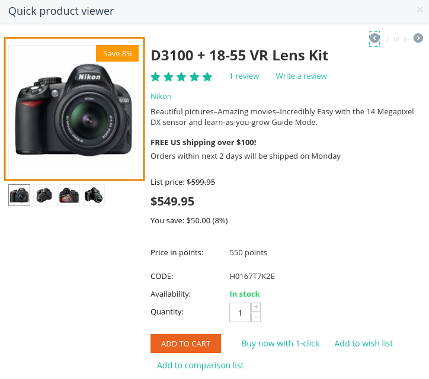
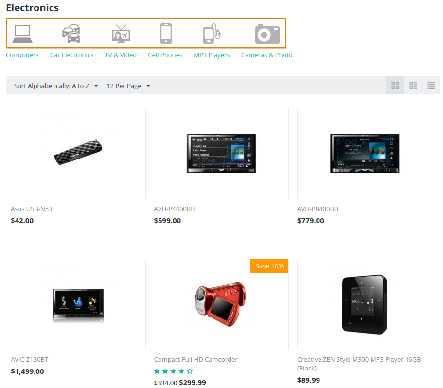
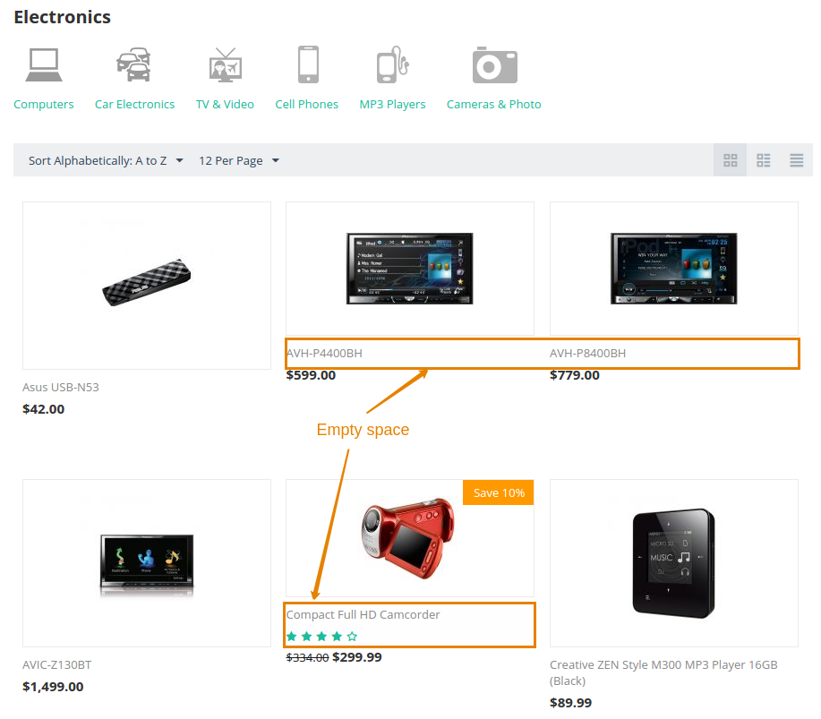

***********************************************
How To: Change the Image Size on the Storefront
***********************************************

===================
General Information
===================

To change the size of images on the storefront, complete the following steps:

1. In the Administration panel, go to **Settings → Thumbnails**.

   .. image:: img/change_image_size.png
        :align: center
        :alt: Fill in the fields in the Thumbnails settings to specify thumbnail size on various pages.

2. Specify the desired quality value in the **JPEG format quality (0-100)** field.

3. To change the size of the thumbnail images on the storefront, edit the values of the corresponding settings.

4. Click the **Save** button to save the changes.

.. note::

    After changing these settings you will need to re-generate thumbnails. To do it, go to **Administration → Storage → Clean up generated thumbnails**.

======================================
Image Types and Corresponding Settings
======================================

This section describes, which settings in **Settings → Thumbnails** affect images in various locations.

------------
Product List
------------

**Settings:**

* *Products list (category, search, etc) thumbnail width*

* *Products list (category, search, etc) thumbnail height*

CS-Cart displays product lists in 2 cases:

* On the category pages, for example, for example, *Electronics*, *Apparel*, etc. These are the pages represented by a :doc:`layout page <../layouts/layout_pages/index>` with the ``categories.view`` dispatch.

  .. image:: img/change_image_size_02.png
      :align: center
      :alt: Products lists thumbnails on the storefront.

* In the **Products** :doc:`block <../layouts/blocks/index>`, which can serve different functions on different pages, like *Hot deals*, *On sale*, *Newest products*, etc.

  .. image:: img/change_image_size_03.png
      :align: center
      :alt: Products lists thumbnails on the storefront.

--------------------
Product Details Page
--------------------

**Settings:**

* *Product details page thumbnail width*

* *Product details page thumbnail height*

---------------
Quick View Page
---------------

**Settings:**

* *Product quick view thumbnail width*

* *Product quick view thumbnail height*

---------
Cart Page
---------

**Settings:** 

* *Product cart page thumbnail width*

* *Product cart page thumbnail height*

  .. image:: img/change_image_size_06.png
      :align: center
      :alt: Cart page thumbnails on the storefront.

---------------
Category Images
---------------

**Settings:**

* *Categories list thumbnail width*

* *Categories list thumbnail height fields*

.. note::

    The settings below are no longer used in CS-Cart/Multi-Vendor core.

* *Category details page thumbnail width*

* *Category details page thumbnail height*

* *Detailed category image width*

* *Detailed category image height fields*

===========================================
What Happens to Images When Size is Changed
===========================================

If the uploaded image has larger than the dimensions allowed by the settings, then the image is downsized to match the dimensions. The aspect ratio of the image doesn't change during downsizing. There are two possible scenarios here:

* If both height and width are specified, the image will be downsized and centered. Background color will fill the areas not covered by the downsized image.

* If only a width or height is specified, then the image will be downsized according to it, and the aspect ratio will determine the missing width/height. No background color will be added.

Images will not be stretched if their size is smaller than the image size specified in the settings. Instead the uploaded image will be centered, and the aspect ratio will determine the missing width/height. The background color will fill the areas that the uploaded image doesn't cover. 

The color of the background is determined by the **Thumbnail background color** setting.

.. important::

    If you specify only height or only width, then the product list may look irregular.

