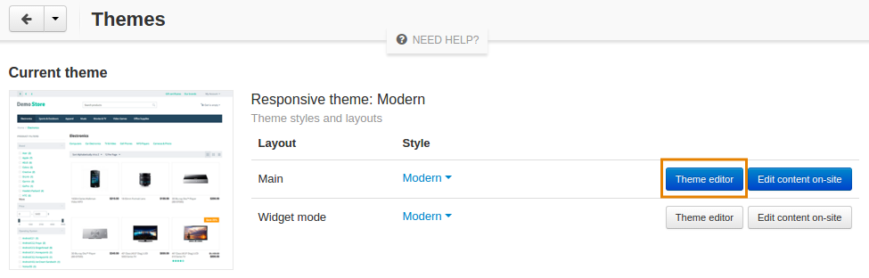
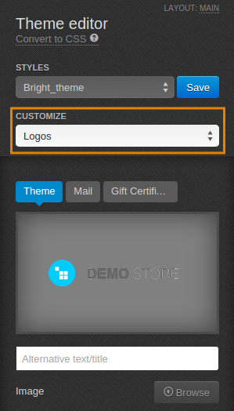

*******************************
How To: Change the Company Logo
*******************************

To replace CS-Cart logo with yours:

1.   In the Administration panel, go to **Design → Themes**.
2.   In the currently used theme click the **Theme Editor** button.

3.   In the **Theme Editor** panel select **Logos** from the drop-down menu of the **Customize** field.

4.   Choose the **Theme**, **Mail**, and **Gift Certificate** tabs to edit corresponding logos. Click the **Browse** button to upload images for logos.

.. important ::

	Default styles can not be modified. Create a new style to upload your logos. To do it, choose one of the default styles, click the **Save** button near it, and type a new style name in the pop-up window.

        .. image:: img/logo_03.png
            :align: center
            :alt: Save pop-up

5.   Click the **Save** button.
