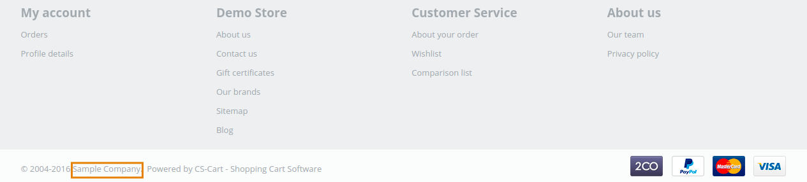

*******************************
How To: Change the Company Name
*******************************

To change the company name:

1.   In the Administration panel, go to **Settings → Company**.
2.   In the opened page edit the **Company name** field.
3.   Click the **Save** button.

.. image:: img/c_name.png
    :align: center
    :alt: Settings

.. note::

    The company name is displayed on the storefront at the bottom of a page. Also it is assigned to the storefronts in **Administration → Stores → [storefront name] → Settings: Company**.

