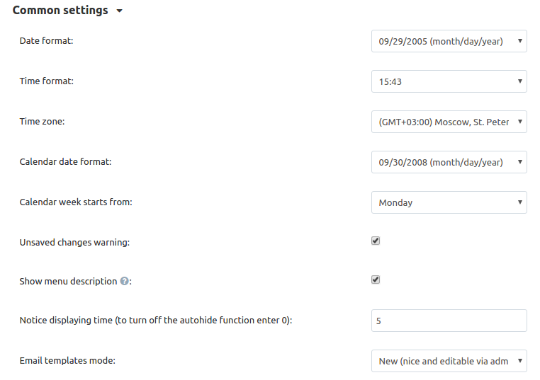

************************************************************
How To: Change CS-Cart Time Zone and Datetime Display Format
************************************************************

===================
General Information
===================

A time zone is a standard of time for a specific region on the globe. The standard is used for legal, commercial, and social purposes. Setting a proper time zone for your store can help your customers keep track of special events like sales, giveaways, etc.

A datetime panel shows time and date of events in the store. It is used in many different places, for example: 

* It tracks the time the order was placed. 

  .. image:: img/time_and_date_02.png
      :align: center
      :alt: Date and time on the orders page

* It tracks the time the product review was added.

  .. image:: img/time_and_date_03.png
      :align: center
      :alt: Date and time on the storefront

================================================
Changing a Time Zone and Datetime Display Format
================================================

1. In the Administration panel, go to **Settings → Appearance**.

2. Make the changes in the **Common settings** section.

3. Click the **Save** button to save the changes.

.. note:: 

   This change will affect the dates of all **future** events—the time of placed orders, user registration, etc.
