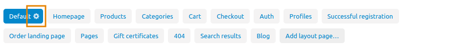

*****************************
How To: Change the Page Title
*****************************

To change the standard page title:

*   In the Administration panel, go to **Design → Layouts**.
*   In the **Default** tab click on the gear icon. This will open a pop-up window.

*   In the **Page title** field define your page title and click the **Save** button to apply the changes.

.. image:: img/title_02.png
    :align: center
    :alt: Page title

To change the page title for the product page, category page, and other pages:

*	Open the page the name of which you want to change. E.g., to change the name of the *Product detailed page of a specific product*, go to **Products > Products** and click on the product name.
*   Find the **Meta data** section (e.g. in the *Product editing page* go to the **SEO** tab) and change there the **Page title**.
*   Click the **Save** button.

.. image:: img/title_03.png
    :align: center
    :alt: Meta Data

.. note ::

	To add/change **Page title** using the `import <http://docs.cs-cart.com/4.4.x/user_guide/manage_products/import_export/product_import.html>`_ option, use the instructions from the `Imported Fields Format <http://docs.cs-cart.com/4.3.x/user_guide/manage_products/import_export/fields_format.html>`_ article.
