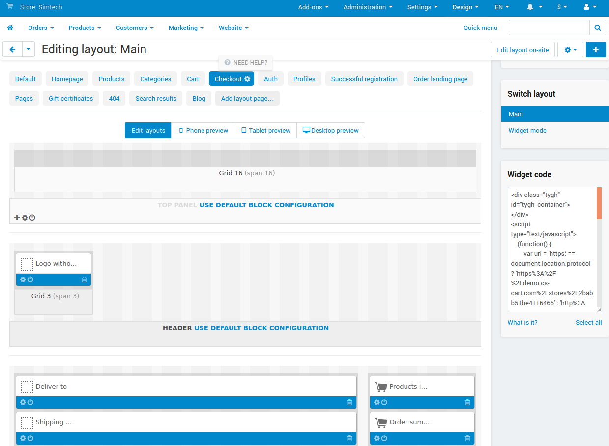
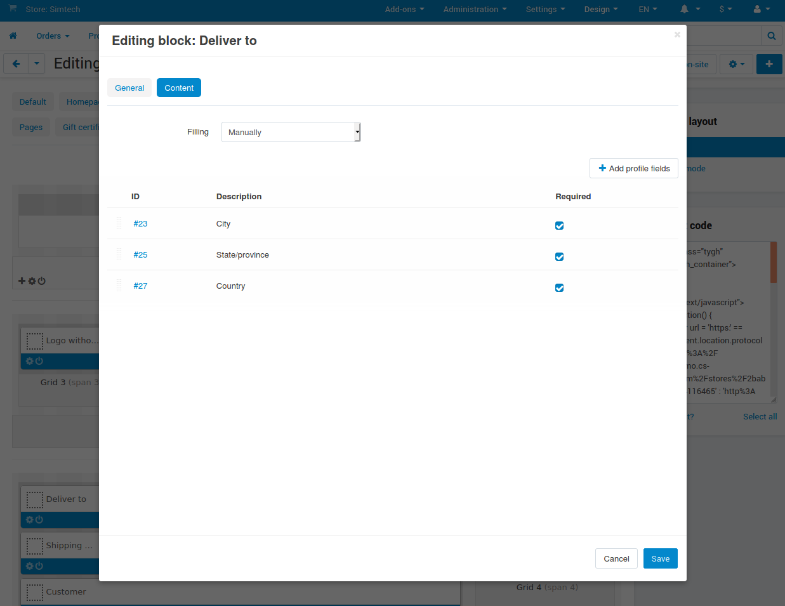

*********************************
Where to Configure Checkout Page?
*********************************

In this article, we've tried to gather all the tools in CS-Cart for changing the look of the checkout page without any coding knowledge.

.. important::

    This article doesn't cover the deprecated :doc:`Step-by-Step Checkout </user_guide/addons/step_by_step_checkout/index>` add-on. Its configuration is much more limited, and everything is done in the settings of the add-on.

.. contents::
   :backlinks: none
   :local:

==================
Configure Sections
==================

The checkout page consists of :doc:`blocks </user_guide/look_and_feel/layouts/blocks/index>`. To edit it, go to **Design → Layouts** and switch to the **Checkout** tab. We'll be doing most of checkout configuration there.

On that page, you can:

* Change the order of sections. For example, you can move contact information to the beginning, and shipping method selection to the end, if you'd like.

* Disable or delete other blocks you don't need. For example, a software store can :doc:`disable shipping method selection </user_guide/shipping_and_taxes/shipping_methods/disable_shipping>`.

* Add other blocks that you'd like to see on the checkout page.

  .. important::

      All the blocks the names of which begin with ``Checkout:`` must be located in one grid. That grid must have *Lite checkout* selected as a **Wrapper**.

================
Configure Fields
================

At checkout, customer leaves most of the information via :doc:`profile fields </user_guide/users/customers/change_profile_fields>`. They are placed to the page via blocks. 

The block settings (the gear icon under the block) allows you to:

* Show block name on the checkout page (if you select a wrapper).

* Change the order of profile fieds in the block via drag & drop.

* Make certain profile fields required or not required on the checkout page.

* Remove unnecessary fields and add the ones you need. The fields that can be added depend on the block.

  .. important::

      If the settings of a :doc:`shipping method </user_guide/shipping_and_taxes/shipping_methods/index>` have **Customer must specify his/her address** disabled, then the block with the customer's address will be hidden when the shipping method is selected.

===============
Configure Texts
===============

Any text in CS-Cart and Multi-Vendor can be changed. But the checkout page has many entities. That's why we've gathered the list of places that you should check if you'd like to change the texts in the checkout page:

* :doc:`Profile fields </user_guide/users/customers/change_profile_fields>` (for the names of most fields).

* :doc:`Shipping methods </user_guide/shipping_and_taxes/shipping_methods/index>` and :doc:`payment methods </user_guide/payment_methods/index>` (for their names and descriptions).

* :doc:`Blocks </user_guide/look_and_feel/layouts/blocks/index>` (for section headings).

* :doc:`Language variables </user_guide/look_and_feel/languages/translate>` (for all other texts).

.. meta::
   :description: Info on how to change profile fields at checkout in CS-Cart and Multi-Vendor ecommerce software.
