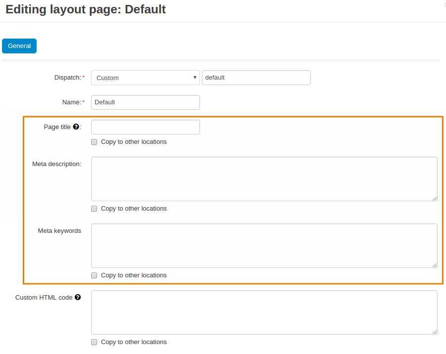
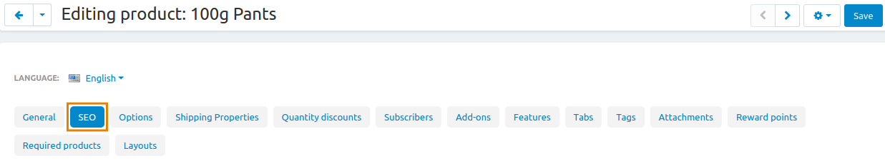
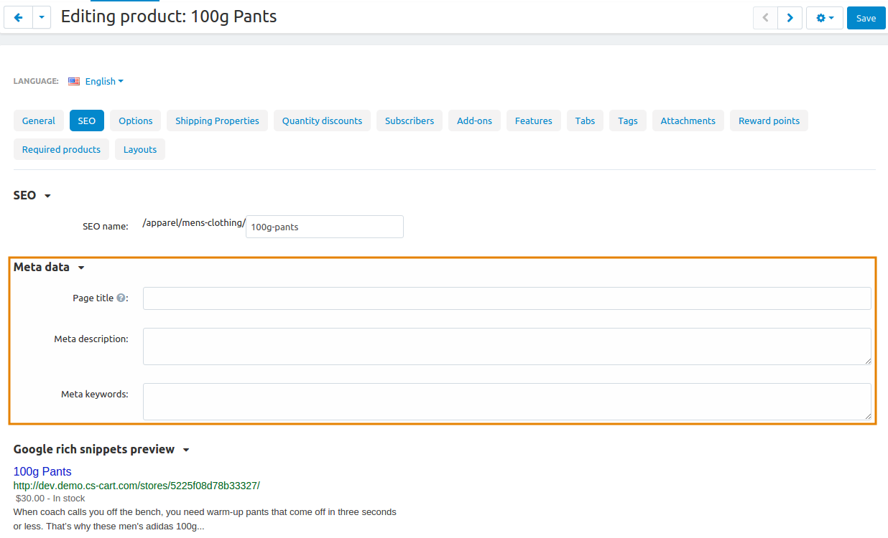

*********************************
How To: Change the Page Meta Data
*********************************

**Meta data** are data that provide information about other data. The meta data help tell search engines what the page is about. The meta data do not appear on the store's page except for the page title that appears on the browser tab.

There are three types of the meta data in CS-Cart:

* **Page title**—Title of the page on the storefront, which is displayed in the web browser when somebody is viewing the page. Required for SEO purposes.

* **META description**—Contents of the HTML meta tag describing the category. Required for SEO purposes.

* **META keywords**—Contents of the HTML tag containing a list of search keywords for the category. Required for SEO purposes.

In CS-Cart the meta data structure can be described as a three-level hierarchy:

* **Layouts: Location: Default**—the meta data of the default :doc:`layout page. <../layouts/layout_pages/index>`

* **Layouts: Location: Current**—the meta data of a particular :doc:`layout page. <../layouts/layout_pages/index>`

* **Object editing page**—the meta data of a particular object, like a product, a category, etc.

==============================
Changing the Default Meta Data
==============================

1.   In the Administration panel, go to **Design → Layouts**.
2.   Click the gear icon on the **Default** tab.

.. note::

    If you set another layout page as default, edit that page instead.

.. image:: img/title_01.png
    :align: center
    :alt: the Default tab

3.   In the opened window edit **Page title**, **Meta description** and **Meta keywords** fields.

4.   Click the **Save** button.

==================================
Changing the Layout Page Meta Data
==================================

1.   In the Administration panel, go to **Design → Layouts**.
2.   Click the gear icon on the desired layout tab.

3.   In the opened window edit **Page title**, **Meta description** and **Meta keywords** fields.

.. image:: img/meta_04.png
    :align: center
    :alt: Products settings

4.   Click the **Save** button.

=============================
Changing the Object Meta Data
=============================

1.   In the Administration panel, open the desired page (e.g., to change the meta data of the *Product detailed page of a specific product*, go to **Products → Products**) and click on the product name.
2.   Switch to the **SEO** tab.

3.   In the opened window find the **Meta data** section and edit **Page title**, **Meta description** and **Meta keywords** fields.

4.   Click the **Save** button.

.. note:: 

	To add **Meta data** using the `import <http://docs.cs-cart.com/4.3.x/user_guide/manage_products/import_export/product_import.html>`_ option, use the instructions from the `Imported Fields Format <http://docs.cs-cart.com/4.3.x/user_guide/manage_products/import_export/fields_format.html>`_ article.
