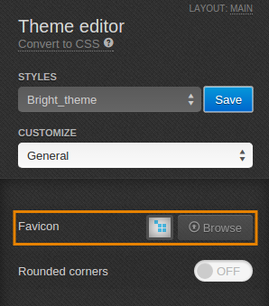
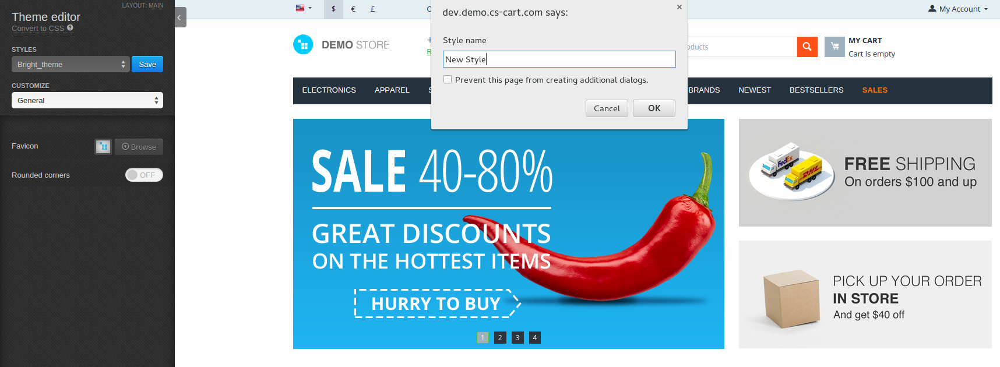

*******************************
How To: Replace CS-Cart Favicon
*******************************

To replace CS-Cart favicon:

1.   In the Administration panel, go to **Design → Themes**.
2.   In the currently used theme click the **Theme editor** button.
3.   In the **Theme editor** panel on the left find the **Favicon** line and click the **Browse** button.

4.   Upload the desired image for the favicon (it must be 16x16 px) and click the **Save** button.

.. important ::

	Default styles can not be modified. Create a new style to upload your favicon. To do it, choose one of the default styles, click the **Save** button near it, and type a new style name in the pop-up window.

