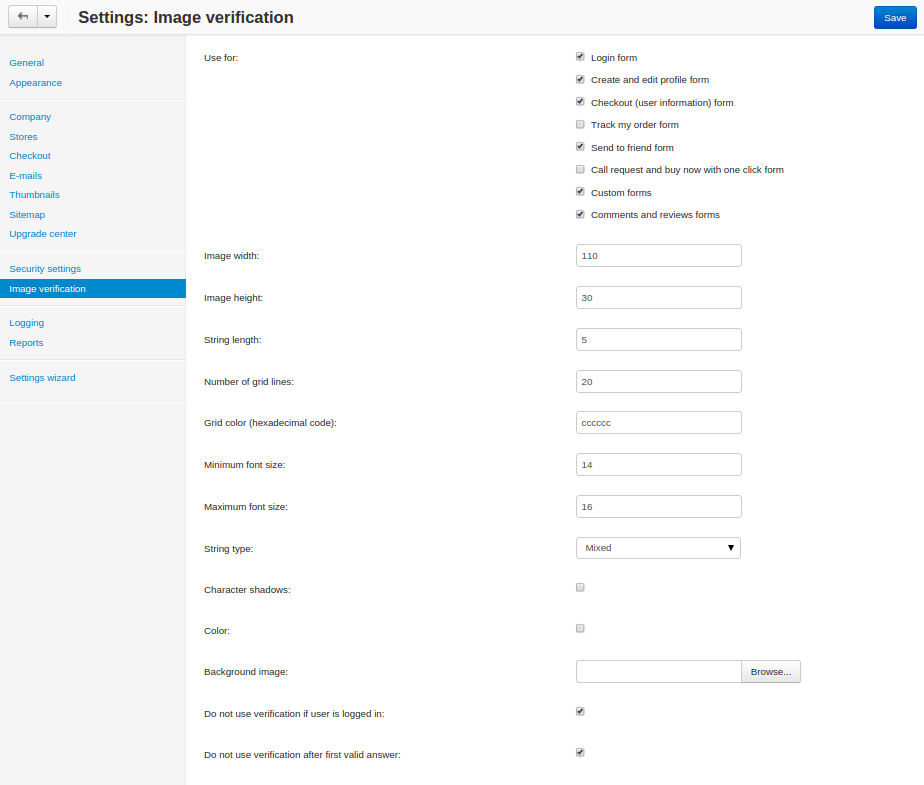

*******************************************
How To: Set Up Image Verification (CAPTCHA)
*******************************************

.. important::

    Bots can bypass the CAPTCHA described in this article. We recommend using one of the `third-party Google reCAPTCHA add-ons from our Marketplace <http://marketplace.cs-cart.com/?subcats=Y&status=A&pshort=Y&pfull=Y&pname=Y&pkeywords=Y&search_performed=Y&cid=88&q=google+recaptcha&dispatch=products.search&sl=en>`_ instead.

**Image verification (CAPTCHA)** is a way to determine that it's a human being that attempts to do something in your store: create an account, log in to an existing account, leave a comment, etc. If enabled and configured, image verification will allow to perform these and many other actions only if a user enters the text from a randomly generated image.

You can see how image verification works in the picture below: there is a new mandatory *Anti-bot validation* field.

.. image:: img/image_verification.png
    :align: center
    :alt: Image verification as it appears on the login page: it adds the new mandatory Anti-Bot Validation field.

To enable image verification in your store, complete the following steps:

1. In the Administration panel, go to **Settings → Image Verification**.

2. Tick the necessary checkboxes in the **Use for** section.

3. Fill in other fields as you see fit.

4. Click the **Save** button.

.. important::

    You must have **GD Library** installed on the server for CS-Cart to display verification images. PHP must be compiled with **freetype support**. So PHP must be configured with the following keys: ``--with-gd --enable-gd-native-ttf``

