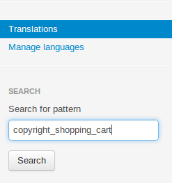

************************************************
How To: Replace the "Powered by CS-Cart..." Link
************************************************

To replace the **Powered by CS-Cart - Shopping Cart Software** link with yours:

*   In the Administration panel, go to **Administration → Languages → Translations**.
*   In the **Search** on the right type *copyright_shopping_cart* into the **Search for pattern** input field and click **Search**.

*   Edit the found language variable (e.g., replace it with your company name) and click the **Save** button.

.. image:: img/powered_by_02.png
    :align: center
    :alt: Language variable

.. note ::

	If the applied changes are not displayed, try clearing the template cache. To do it, go to **Administration → Storage → Clear cache**.