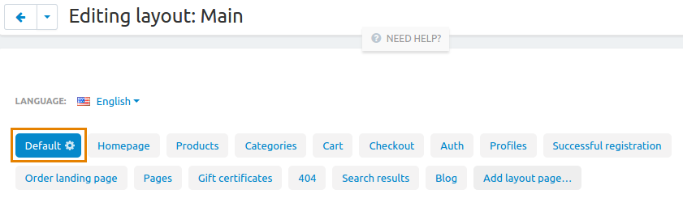
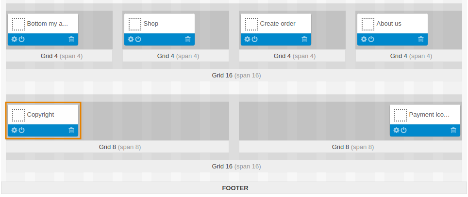

***********************************************************
How To: Replace and Delete the "Powered by CS-Cart..." Link
***********************************************************

==================
Replacing the Link
==================

To replace the **Powered by CS-Cart—Shopping Cart Software** link with yours:

1.   In the Administration panel, go to **Administration → Languages → Translations**.
2.   In the **Search** on the right type *copyright_shopping_cart* into the **Search for pattern** input field and click **Search**.

.. image:: img/powered_by_01.png
    :align: center
    :alt: Search

3.   Edit the found language variable (e.g., replace it with your company name) and click the **Save** button.

.. image:: img/powered_by_02.png
    :align: center
    :alt: Language variable

.. note ::

	If the applied changes are not displayed, try clearing the template cache. To do it, go to **Administration → Storage → Clear cache**.

=================
Deleting the Link
=================

To delete the **Powered by CS-Cart—Shopping Cart Software** link:

1.   In the Administration panel, go to **Design → Layouts**.
2.   Select the **Default** layout.

3.   At the bottom of the page find the **Copyright** block, click the **Trash** icon on the block and delete it. Instead of deleting you can deactivate the block. Click the **Switch** icon to deactivate the block.

