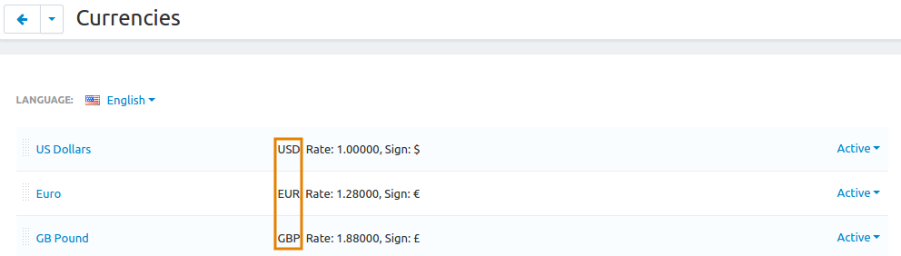

*******************************************************************
How To: Display Prices on the Storefront Only in Secondary Currency
*******************************************************************

We have developed a free add-on that displays prices on the storefront only in one selected currency. You can also choose one currency for the Administration panel. The currencies you choose for the Administration panel and the storefront don't have to be the primary currency.

.. hint::

    If you want to have selectable currencies on the storefront, but want to have a secondary currency selected by default, please check this :doc:`article. <secondary_currency>`

.. image:: img/prices_in_secondary_currency_03.png
    :align: center
    :alt: A price in a secondary currency is displayed on the storefront. Customers can't select other currencies.

==========================
Step 1. Install the Add-on
==========================

1. Download the **Product Prices in Secondary Currency** add-on using `this link <https://github.com/cscart/addon-hide-primary-currency/archive/master.zip>`_. You'll get a ZIP archive.

   .. note::

       You're also welcome to visit `the add-on's repository on GitHub. <https://github.com/cscart/addon-hide-primary-currency>`_

2. Log in to the Administration panel of your store.

3. Go to **Add-ons → Manage add-ons**.

4. Сlick the **+** button to upload the add-on.

.. image:: img/addons_plus_button.png
    :align: center
    :alt: Add-ons plus button

5. In the pop-up window click **Local**, and choose the ZIP archive you downloaded earlier.

6. Click **Upload & install**.

.. image:: img/upload_and_install_addon.png
    :align: center
    :alt: Upload and install pop-up

=============================
Step 2. Choose the Currencies
=============================

1. Find **Product Prices in the Secondary Currency** on the list of add-ons and click on the add-on's name.

.. image:: img/prices_in_secondary_currency_01.png
    :align: center
    :alt: The Product Prices in the Secondary Currency add-on

2. You'll see two settings: **Desired admin currency code** and **Desired storefront currency code**. Fill in both fields.

   .. hint:: 

       You can find the currency codes under **Administration → Currencies**. The codes appear to the left of the exchange rate.

3. Click **Save**.

   .. important::

       When editing products, you'll have to specify the prices in the primary currency of your store. This is because all calculations are still done in the primary currency. Prices in other currencies are simply displayed according to the rate that you specify.

