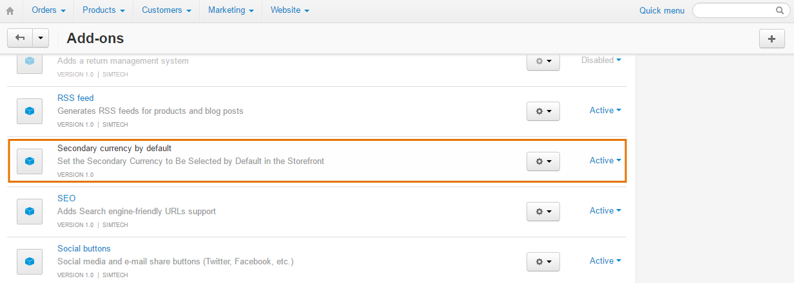
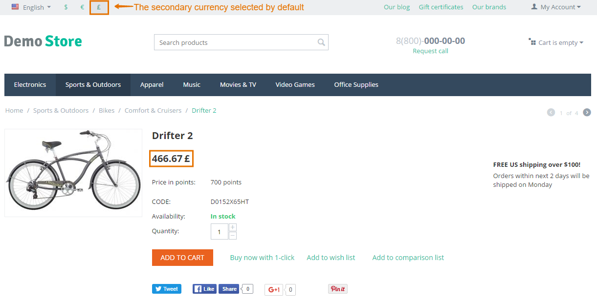

******************************************************************************
How To: Set the Secondary Currency to Be Selected by Default on the Storefront
******************************************************************************

To set the secondary currency to be selected by default on the storefront use the **Secondary Currency by Default** add-on.

=============================
Step 1. Installing the Add-on
=============================

To get and install this add-on, do the following:

1. Download the Secondary Currency by Default add-on archive using `this link <https://github.com/cscart/addon-default-secondary-currency/archive/master.zip>`_.

.. note::

    If you want to check the add-on code, please, visit `the add-on page on GitHub <https://github.com/cscart/addon-default-secondary-currency>`_. 

2. Log in to the Administration panel of your store.

3. Go to **Add-ons → Manage add-ons**.

4. Сlick the **+** button to upload the add-on.

.. image:: img/addons_plus_button.png
    :align: center
    :alt: Add-ons plus button

5. In the pop-up window click **Local**, and choose the add-on archive.

6. Click **Upload & install**.

.. image:: img/upload_and_install_addon.png
    :align: center
    :alt: Upload and install pop-up

The Secondary Currency by Default add-on has been installed.

==========================================================
Step 2. Setting up the Secondary Currency as a Default One
==========================================================

To display the secondary currency as a default one you will need to make some changes in the code of the installed add-on.

1. Open the **default_secondary_currency** folder located in the *app/addons* directory of your CS-Cart installation.

2. In this folder, open the **func.php** file.

3. Replace ``DESIRED_CURRENCY_CODE`` with the 3-symbol code of the currency that you want to be selected by default on the storefront (USD, EUR, etc.).

.. image:: img/prices_in_secondary_currency_02.png
    :align: center
    :alt: The 3-symbol code of the currency.

4. Click **Save changes**.

The Secondary Currency by Default add-on is ready for work.

.. important ::

	This modification will keep your other currencies selectable but only set the specified one as selected by default. If you want to hide all other currencies except the desired one, please use the instructions in :doc:`here <../changing_attributes/prices_in_secondary>`.
