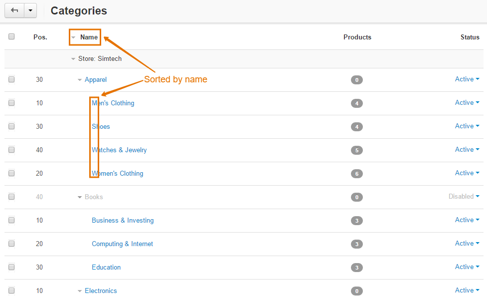

*******************************************************
How To: Sort Subcategories by Name on the Category Page
*******************************************************

Use the **Sort Subcategories by Name** add-on for this purpose. 

To get and install this add-on, follow the steps below:

1. Download the Sort Subcategories by Name add-on archive using `this link <https://github.com/cscart/addon-subcategories-sort/archive/master.zip>`_.

.. note::

    If you want to check the add-on code, please, visit `the add-on page on GitHub <https://github.com/cscart/addon-subcategories-sort>`_.

2. Log in to the Administration panel of your store.

3. Go to **Add-ons → Manage add-ons**.

4. Сlick the **+** button to upload the add-on.

.. image:: img/addons_plus_button.png
    :align: center
    :alt: Add-ons plus button

5. In the pop-up window click **Local**, and choose the add-on archive.

6. Click **Upload & install**.

.. image:: img/upload_and_install_addon.png
    :align: center
    :alt: Upload and install pop-up

.. important::

    Another way is to unpack the archive and copy the content of the resulting folder to the root directory of your store on the server. Then go to **Add-ons → Manage add-ons**, choose **Browse all available add-ons** and install the add-on.

.. image:: img/sort_subcategories_01.png
    :align: center
    :alt: The Sort Subcategories by Name add-on

.. note::

    The subcategories will be automatically sorted by name immediately after the add-on was installed and activated.

