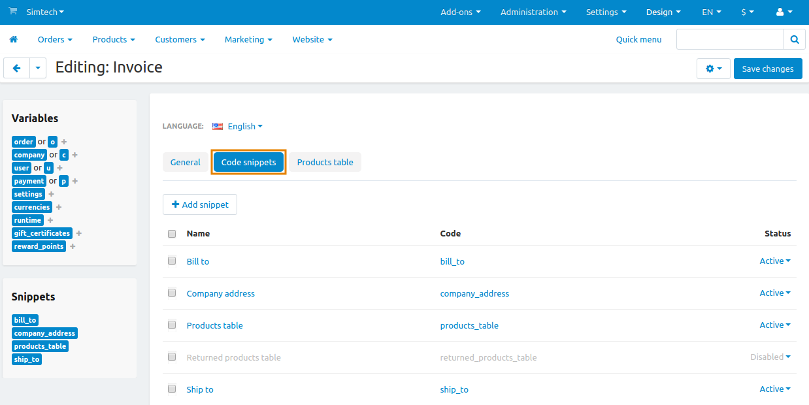
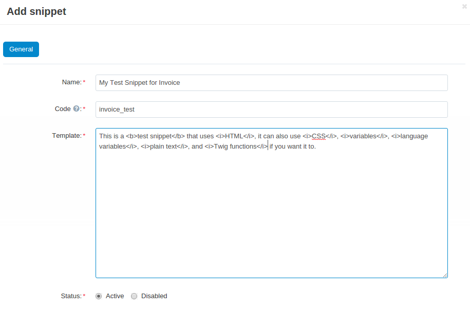
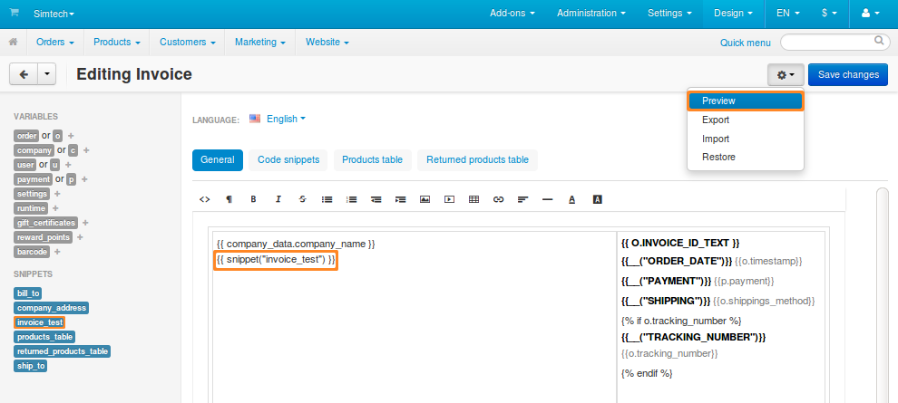
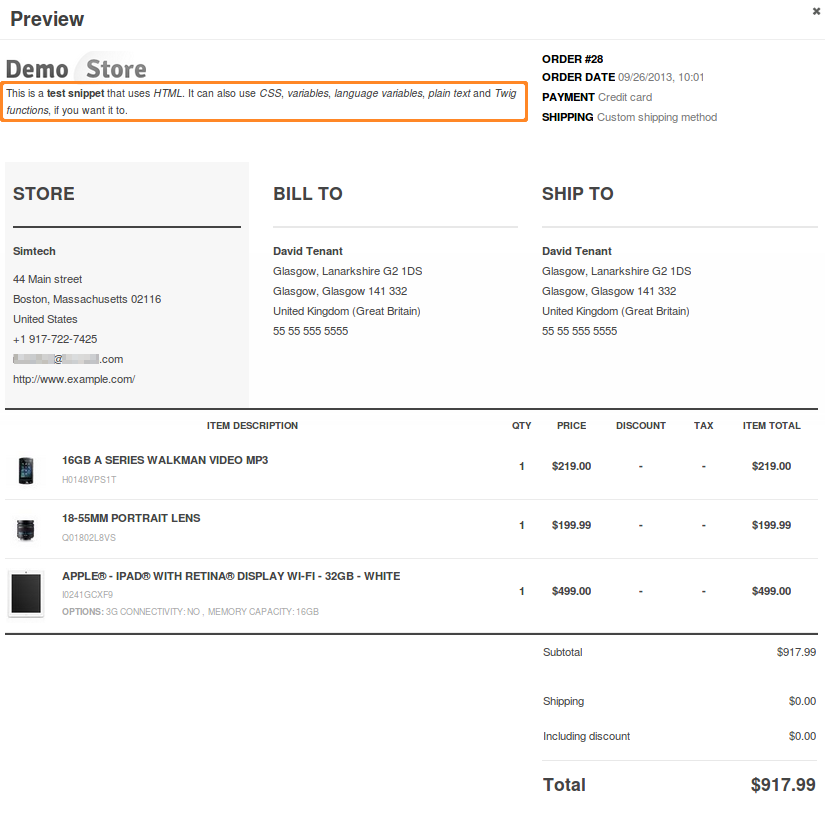

*********************
Snippets in Documents
*********************

Documents can get quite complex, especially when you see variables instead of texts and numbers. That’s why we suggest using snippets to make a document look less cluttered in the editor.

Let’s assume that you want to add some information to a document and display it only if certain conditions are met. You could add the information and conditions right to the document code, but that would make the document code look more complicated in the editor.

Instead you can create a snippet and add that information and conditions there. Once you save the snippet, you’ll be able to insert all its content and conditions by simply inserting a reference to the snippet into a document.

.. note::

    Changes in a snippet will automatically apply to the document.

.. contents::
   :backlinks: none
   :local:

===============
Manage Snippets
===============

The list of snippets for documents is available under **Design → Documents**. Click the name of the required document and switch to the **Code snippets** tab. There you can add, edit, and delete snippets for that specific document.

.. important::

    Each document has its own snippets, which are separate from the snippets of other documents.

------------------
Add/Edit a Snippet
------------------ 

1. To add a new snippet, click the **+** button in the top right corner of the screen. To edit an existing snippet, click on its name.

2. A popup window will open. Edit the snippet here:

   * **Name**—the name of the snippet. It exists mostly for convenience. Multiple snippets can have the same name.

   * **Code**—a sequence of characters that is used to identify the snippet and insert it into a document. It must be unique for each snippet.

   * **Template**—the content of the snippet. Here you can use plain text, variables, language variables, Twig functions, HTML, and CSS code.

   * **Status**—a snippet can be *Active* or *Disabled*. Disabled snippets don’t change a document in any way and don’t appear among available snippets when you edit the document.

3. Once you are done editing the snippet, click **Create** (or **Save**, if the snippet already exists).

.. note::

    If you edit an existing snippet, the **Restore** button will appear next to the **Save** button. The **Restore** button returns the snippet to its initial state (as it was when the snippet was created).

---------------
Delete Snippets
---------------

* To delete one snippet, click the **gear** button of that snippet and choose **Delete**.

* To delete multiple snippets at once:

  1. Tick the checkboxes next to the snippets you want to delete.

  2. Click the **gear** button in the top right corner of the page.

  3. Choose **Delete selected**.

-------------------------
Export or Import Snippets
-------------------------

All the snippets of a document are exported and imported together with the document in one XML file. The export and import are done on the **Design → Documents** page via the **gear** button. The detailed instructions are available in :doc:`this documentation article <document_export_and_import>`.

.. important::

    An imported snippet will overwrite a snippet that exists in your store, if both snippets have the same ``<code>``.

==============================
Insert Snippets into Documents
==============================

All snippets with the *Active* status appear among the available snippets in the document editor. Just click on the snippet, and it will be added to the place of the document where you left the cursor.

As an alternative, you can insert a snippet manually. For example, to insert a snippet with the code ``invoice_test``, add ``{{ snippet(“invoice_test”) }}`` to the document. Once you do that, the content of the snippet should appear in document preview.

