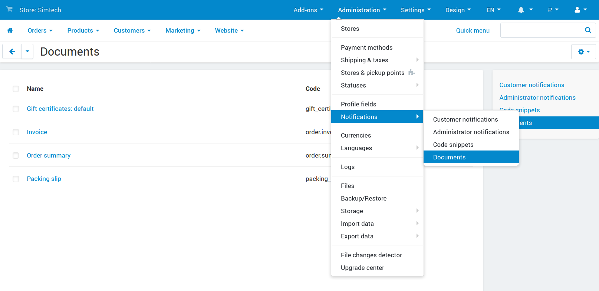
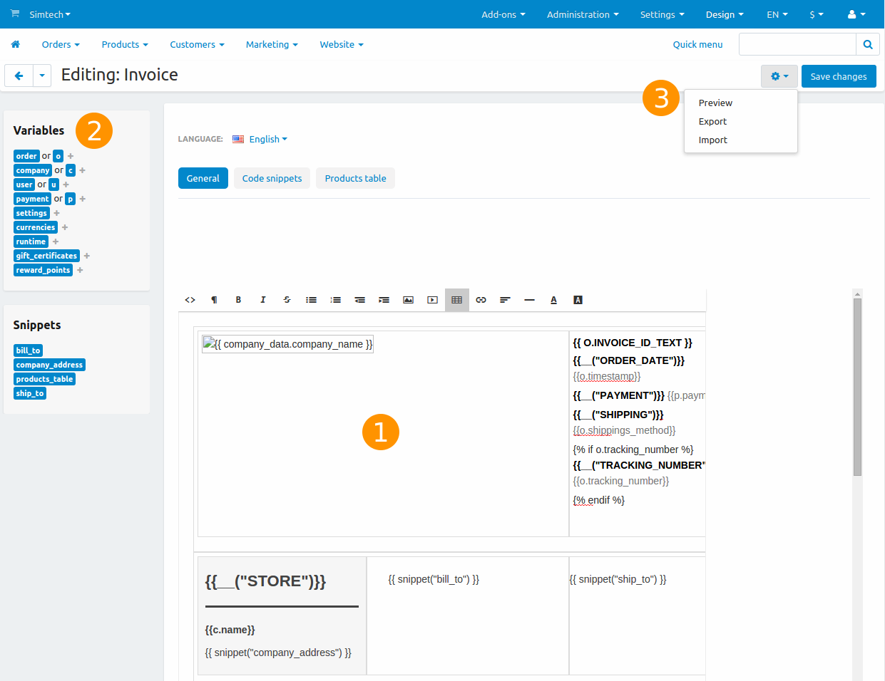

*********
Documents
*********

Starting with version 4.4.1, CS-Cart and Multi-Vendor come with a built-in editor for documents, such as invoices, packing slips, and gift certificates. You can customize the documents according to your needs, or import the documents that were created and exported by someone else.

To access the document editor, go to **Design → Documents**.

.. note::

    If you upgraded to 4.4.1 from an earlier version of CS-Cart or Multi-Vendor, :doc:`you may need to enable the editor first. <enable_document_editor>`

.. contents::
   :backlinks: none
   :local:

======================
List of Document Types
======================

The editor contains the list with all the types of documents that you can edit. Please note that third party add-ons can add their own document types, which may or may not appear on the list.

.. note::

    The editor also allows you to :doc:`import and export documents <document_export_and_import>` via the **gear** button.

So far the following types of documents have been implemented:

* Order invoice

* Order summary

* Packing slip

* Gift certificate

* Suppliers: Invoice

* Return request: Packing slip

.. note::

    Please note that the last three document types appear only when you activate the **Gift certificates**, **Suppliers**, and **RMA** add-ons respectively. 

============================
Structure of Document Editor
============================

When you click on the name of any document from the list, the editing page will open. Let’s take a look at how the editor is organized.

----------------
1. The Main Area
----------------

The main area in the middle of the page is where you edit documents. A document is basically a template that includes variables, language variables, snippets, and plain text. When the actual document is generated from that template, the variables are replaced by real data from your store.

By default, the visual editor is enabled, making it easier to see the structure of the document. However, you can also view and edit the HTML code of the document by clicking the **<>** (**Source code**) button in the visual editor.

.. note::

    You can change the visual editor or disable it altogether. To do that, go to **Settings → Appearance** and change the **Default WYSIWYG editor** setting. This will also affect other places where the visual editor is used (for example, product and category editing pages).

The changes you make to variables or snippets via the visual editor will affect the generated document. For example, if you make a variable bold, then the value of the variable will be displayed in bold as well.

The main area has multiple tabs:

* **General**—this is where you preview the document and edit most of it.

* **Code snippets**—the list of snippets (pre-made parts) available for this document. On this tab you can create new snippets or edit existing ones.

* **Products table**—the list of columns of the product table that appears in the document. You can customize the product table by adding, editing, disabling, and deleting the columns. This table is added to the document via the ``products_table`` code snippet.

* **Returned products table**—the list of columns of the table with the returned products. It works the same way as the product table, but is added to the document via the ``returned_products_table`` code snippet. 

  This tab appears only for invoice and order summary, and only when the **RMA** add-on is active.

.. note::

    The names of columns on the **Products table** and **Returned products table** tabs are language-dependent: you can set the names of columns for each language separately.

-------------------------
2. Variables and Snippets
-------------------------

On the left you’ll see the list of variables and snippets that you can use in document templates. Clicking on a variable or a snippet will automatically insert it to the place in the document where you left the cursor.

* **Variables** contain various information from the database, such as the name of the customer or the ID of the order.

  You can also use :ref:`language variables <language-variables>` in your documents. For example, adding ``{{__("tracking_number")}}`` to the template will put the text “Tracking number” (or its equivalent in other languages) to that place in the generated document. This text is stored in the ``tracking_number`` language variable.

* **Snippets** are pre-made parts of documents. We moved complex logic to snippets to make the template look less cluttered in the editor. Each document has its own set of snippets.

  .. hint::

      Learn more about snippets in :doc:`this documentation article. <document_snippets>`

--------------------
3. Available Actions
--------------------

The **gear** button in the top right corner allows you to perform the following actions:

* **Preview**—generate a document and display it in a popup window. Document preview uses only the data that exists in the store. For example, to be able to preview an invoice, you need to have at least one order in your store. To preview the invoice of a specific order, use :doc:`these instructions. <tweak_and_send_invoice>`

  .. note::
      
      If a document is directly embeded into the body of an email, it adopts the style of this email. This means that the document on preview might differ from the document in the email.

* **Export**—export this document along with its snippets to an XML file.

* **Import**—import an XML file with documents. Please note that this action may overwrite other documents, if the imported XML file contains the templates for those documents.

* **Restore**—return the document to its default state in this version of CS-Cart or Multi-Vendor. This action only appears if you changed the document and saved your changes.

  .. warning::

      If you use **Restore**, you’ll lose all the changes you ever made to this document. Before you attempt this action, please back up your notification by :doc:`exporting it. <document_export_and_import>`

===============
In This Section
===============

.. toctree::
    :maxdepth: 4
    :titlesonly:
    :glob:

    enable_document_editor
    document_export_and_import
    tweak_and_send_invoice
    document_snippets
