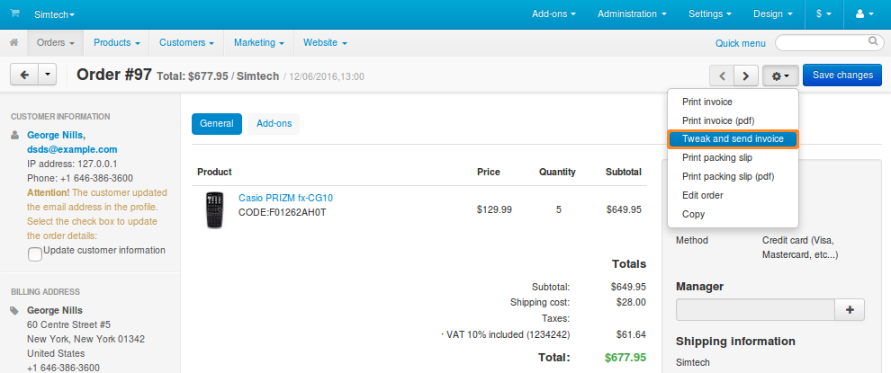
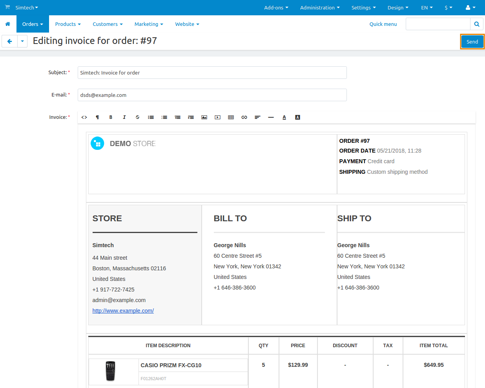

**********************************************************
How To: View, Modify, and Send Invoices of Specific Orders
**********************************************************

By default, a PDF file with the invoice is attached to email notifications that get sent when an order gets the **Processed** or **Complete** status. This behavior can be changed by :doc:`editing the corresponding email notifications. <../email_templates/index>`

You can also make minor changes to a specific invoice and send it in a separate email. To do that, follow these steps:

1. In the Administration panel, go to **Orders → Orders**.

2. Click on the order for which you’d like to modify and send the invoice.

3. Click the **gear** button in the top right corner.

4. Choose **Tweak and send invoice**.

5. The editing page will open, and you’ll be able to edit the following things:

   * **Subject**—the subject of the email that will contain the invoice.

   * **Email**—the email address to which the invoice will be sent. Multiple addresses can be specified like this: *test1@example.com,test2@example.com*.

     .. hint::

         You can send the invoice both to your customer and to your own email address. This is a way to save tweaked invoices for future reference.

   * **Invoice**—the actual invoice generated from the order data. This is the body of your email. You can make any changes to the invoice here, but those changes won’t affect the data in your store.

   * **Attach a PDF document**—if you tick this checkbox, then the invoice will also be attached to the email as a PDF file.

6. When you're ready, click **Send**. This will send the invoice to the specified email address.

.. warning::

    Once you leave the editing page or send the invoice, your changes will be lost. If you want to apply some changes to all your future invoices, please use :doc:`the document editor <index>`.

