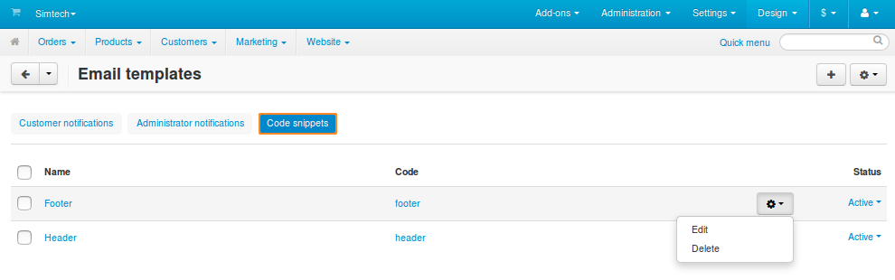
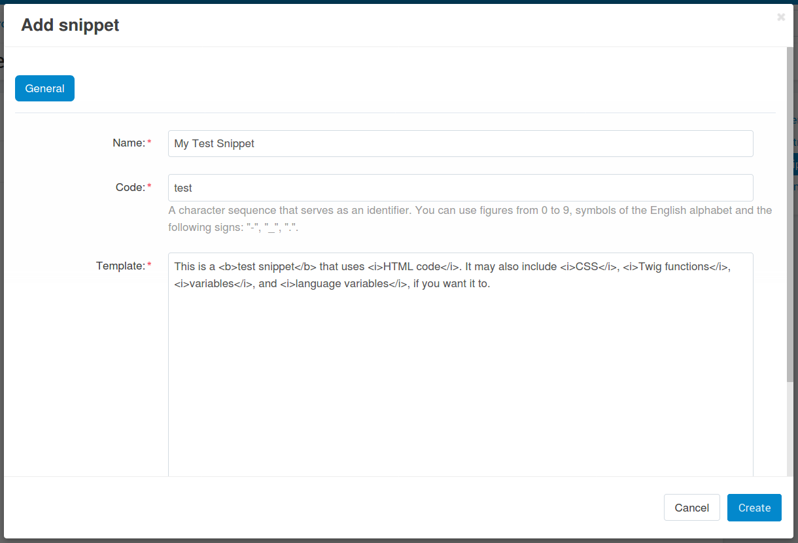
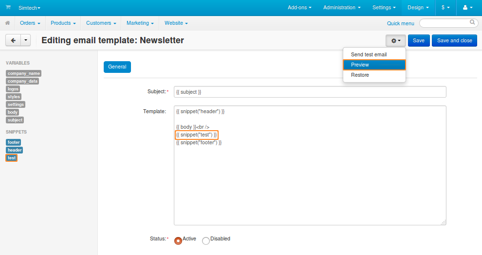
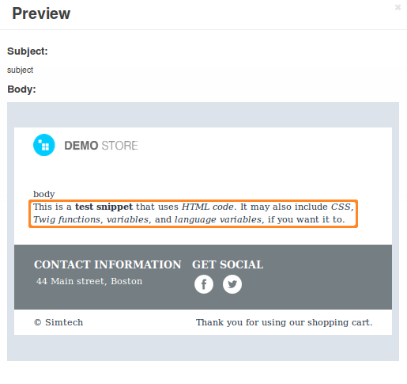

***************************
Snippets in Email Templates
***************************

Snippets are parts of templates that are common for different :doc:`email notifications. <index>` Snippets are useful in 2 cases:

* You want to make certain information (for example, an image, your contact details, and links to important pages of your store) a part of most or all your email notifications.

* You want to insert complex logic into an email template, but don’t want your template to look cluttered in the editor.

In these cases you can create a snippet with the necessary content. Once you save the snippet, you’ll be able to insert all this content by simply inserting a reference to the snippet into an email template.

.. note::

    Changes in a snippet will automatically apply to all email templates that include the snippet.

There are two snippets that exist by default: **Header** and **Footer**. They are used in all email notifications. By default, **Header** passes the variables of the theme to the template. This makes the look of your email notifications match the look of your active theme and style.

.. important::

    This won’t work if you remove the variables of the theme from the **Header** snippet, or remove the snippet itself from the email template.

.. image:: img/different_styles.png
    :align: center
    :alt: Thanks to the Header snippet, the same email notification will look different when switching to other style.

.. contents::
   :backlinks: none
   :local:

===============
Manage Snippets
===============

The list of snippets for email notifications is available under **Design → Email templates** on the **Code snippets** tab. This is the page where you add, edit, and delete snippets.

------------------
Add/Edit a Snippet
------------------
 
1. To add a new snippet, click the **+** button in the top right corner of the screen. To edit an existing snippet, click on its name.

2. A popup window will open. Edit the snippet here:

   * **Name**—the name of the snippet. It exists mostly for convenience. Multiple snippets can have the same name.

   * **Code**—a sequence of characters that is used to identify the snippet and insert it into a template. It must be unique for each snippet.
 
   * **Template**—the content of the snippet. Here you can use plain text, variables, language variables, Twig functions, HTML, and CSS code.
 
   * **Status**—a snippet can be *Active* or *Disabled*. Disabled snippets don’t change an email in any way and don’t appear among the available snippets when you edit an email template.

3. Once you are done editing the snippet, click **Create** (or **Save**, if the snippet already exists).

   .. important::

       If you edit an existing snippet, the **Restore** button will appear next to the **Save** button. The **Restore** button returns the snippet to its initial state (as it was when the snippet was created).

---------------
Delete Snippets
---------------

* To delete one snippet, click the **gear** button of that snippet and choose **Delete**.

* To delete multiple snippets at once:

  1. Tick the checkboxes next to the snippets you want to delete.

  2. Click the **gear** button in the top right corner of the page.

  3. Choose **Delete selected**.

-------------------------
Export or Import Snippets
-------------------------

All your snippets are exported and imported together with email templates in one XML file. Click the gear button in the top right corner of the page and choose **Import** or **Export**. Learn more in :doc:`the article about exporting and importing email templates <email_template_export_and_import>`.

.. important::

    An imported snippet will overwrite a snippet that exists in your store, if both snippets have the same ``<code>``.

====================================
Insert Snippets into Email Templates
====================================

All snippets with the *Active* status appear among the available snippets in the email template editor. Just click on the snippet, and it will be added to the place of the template where you left the cursor.

As an alternative, you can insert a snippet manually. For example, to insert a snippet with the code ``test``, add ``{{ snippet(“test”) }}`` to the template. Once you do that, the content of the snippet should appear in email notification preview.

