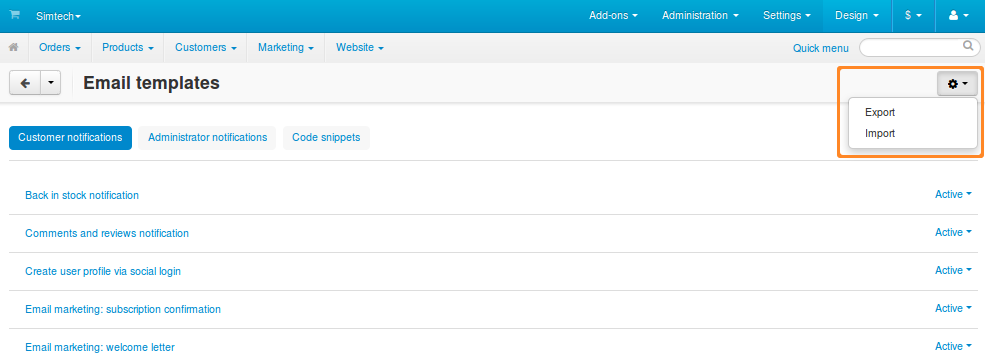
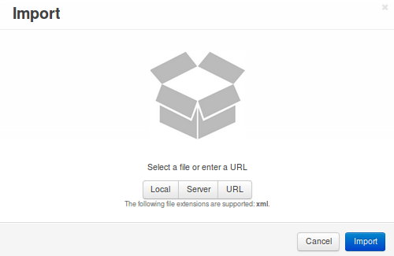

******************************************************
How To: Export and Import Email Templates and Snippets
******************************************************

.. contents::
   :backlinks: none
   :local:

=================================
Export Email Templates & Snippets
=================================

1. Go to **Design → Email templates**.

2. Click the gear button in the top right corner of the page.

3. Choose **Export**. You’ll be offered to download an XML file with all the administrator notifications, customer notifications, and code snippets.

=================================
Import Email Templates & Snippets
=================================

1. Go to **Design → Email templates**.

2. Click the **gear** button in the top right corner of the page.

3. Choose **Import**.

4. Depending on the location of the XML file you’d like to import, click one of the 3 buttons:

   * **Local**—browse your local machine and select an XML file to import.

   * **Server**—browse the server, where your CS-Cart/Multi-Vendor is installed, and select an XML file.

   * **URL**—specify the direct link to the XML file.

5. Click **Import**. The email templates and snippets from the XML file will be imported to your store.

=====
Notes
=====

* All email templates and snippets are exported and imported together in one XML file.

* An imported snippet will overwrite a snippet that exists in your store, if both snippets have the same ``<code>``. The same goes for email templates.

* If you change the ``<code>`` of an email template in the XML file manually and then import that file, a new template will be created. This template will appear on the list in the Administration panel. However, it won’t be used anywhere, unless you have an add-on that sends this new notification.
