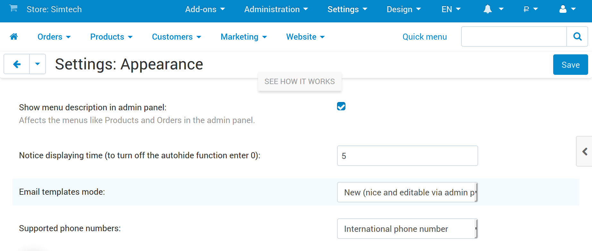

************************************************
What if Changes to Templates Don't Affect Emails
************************************************

This problem can occur when you upgrade from CS-Cart/Multi-Vendor earlier than 4.4.1 via the Upgrade Center. Older versions had email templates based on TPL-files, and those templates aren't affected by the changes in the admin panel. By default, we didn't enable the new templates and the editor automatically, to preserve backward compatibility with any third party add-ons you might have.

To make your changes affect emails:

#. Go to **Settings → Appearance**.

#. Find the **Email templates mode** setting.

#. Choose *New (nice and editable from the admin panel)* from the dropdown list.

#. Click **Save** in the top right corner of the page.

.. important::

    Once you do this, the settings that concern email notifications will disappear from **Administration → Statuses → Order statuses**. You’ll be able to manage email notifications about order status changes under **Administration → Notifications**.

.. meta::
   :description: What should I do if I don't see email template editor in CS-Cart or Multi-Vendor ecommerce platform?

