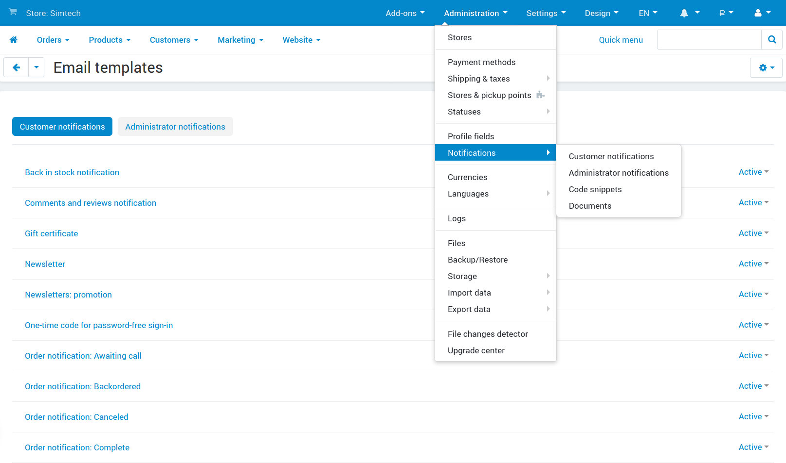
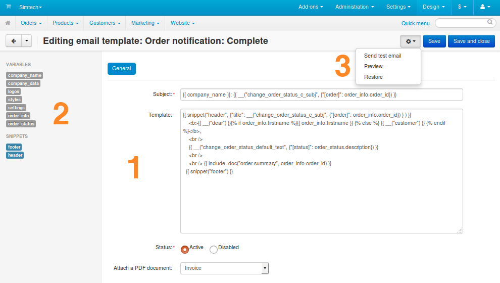

***************
Email Templates
***************

CS-Cart and Multi-Vendor come with a built-in editor for the templates of email notifications. You can customize these templates according to your needs, or import the templates that were created and exported by someone else.

.. contents::
   :backlinks: none
   :local:

================================
List of Email Notification Types
================================

To access the email template editor, go to **Administration → Notifications**. For your convenience the notifications are split into groups:

* Administrator notifications.

* Customer notifications.

* Vendor notifications (only in Multi-Vendor).

There is also a group for code snippets—parts of templates that can be easily inserted into any email notification.

==================================
Structure of Email Template Editor
==================================

When you click on the name of any notification from the list, the editing page will open. Let’s take a look at how the editor is organized.

----------------
1. The Main Area
----------------

The main area in the middle of the page is where you edit a notification. Here’s the list of notification properties:

* **Subject**—the template of the email subject.

* **Template**—the template of the email body.

  .. note::

      These templates can include plain text, variables, language variables, Twig functions, HTML, and CSS code. An actual email notification is generated from **Subject** and **Template** by substituting the variables with the data from your store.

* **Status**—determines whether or not to send the email notifications of this type.

* **Attach a PDF document**—determines which :doc:`document type </user_guide/look_and_feel/documents/index>` (if any) to attach to the email notification as a PDF file.

  .. note::

      You can only attach PDF documents to email notifications about order status changes.

---------------------------------
2. Variables, Snippets, Documents
---------------------------------

On the left you’ll see the list of variables, snippets, and documents that you can use in templates. Clicking on the name of a variable, snippet, or document will automatically insert it to the **Subject** or **Template**. The exact position depends on where you left the cursor.

* **Variables** contain various information from the database, such as the name of the customer or the ID of the order.

  You can also use :ref:`language variables <language-variables>` in email templates. For example, ``dear`` is a language variable that puts *Dear* (or its equivalent in other languages) before the customer’s name. You can insert it into the email notification by adding ``{{ __("dear") }}`` to the right place in the template.

* **Snippets** are pre-made parts of templates that can be reused in different email notifications. You can also make the template look less cluttered in the editor by moving complex logic to snippets.

  .. hint::

      Learn more about snippets in :doc:`this documentation article. <email_snippets>`

* :doc:`Documents </user_guide/look_and_feel/documents/index>` are self-sufficient (unlike snippets), but you can also insert them into emails with one line, so as not to overcomplicate the email template structure.

--------------------
3. Available Actions
--------------------

The **gear** button in the top right corner allows you to perform the following actions:

* **Send test email**—generate a test email from the template and send it to the email address of the administrator who performs this action.

* **Preview**—generate a test email and display it in a pop-up window.

  .. important::

      Due to the lack of data, the examples generated by **Send test email** and **Preview** may look different from the actual emails received by customers and administrators.

* **Restore**—return the **Subject** and **Template** of the email notification to their default states in this version of CS-Cart or Multi-Vendor. This action only appears if you changed the email template and saved your changes.

  .. warning::

      If you use **Restore**, you’ll lose all the changes you ever made to this notification. Before you attempt this action, please back up your notification :doc:`by exporting it. <email_template_export_and_import>`

================
Related Articles
================

.. toctree::
    :maxdepth: 4
    :titlesonly:
    :glob:

    email_template_export_and_import
    email_snippets
    enable_email_editor
    usergroups_notifications

.. meta::
   :description: Where do I edit emails sent by my CS-Cart online store or Multi-Vendor marketplace?
