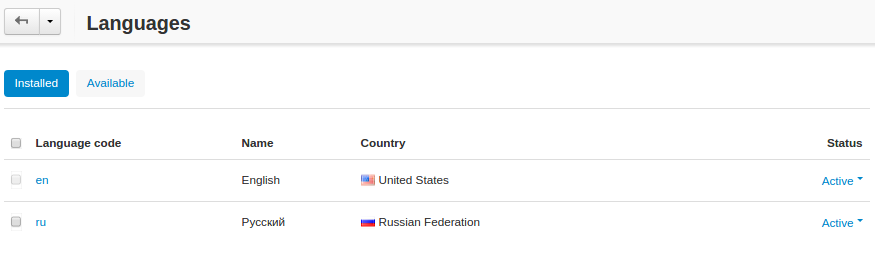
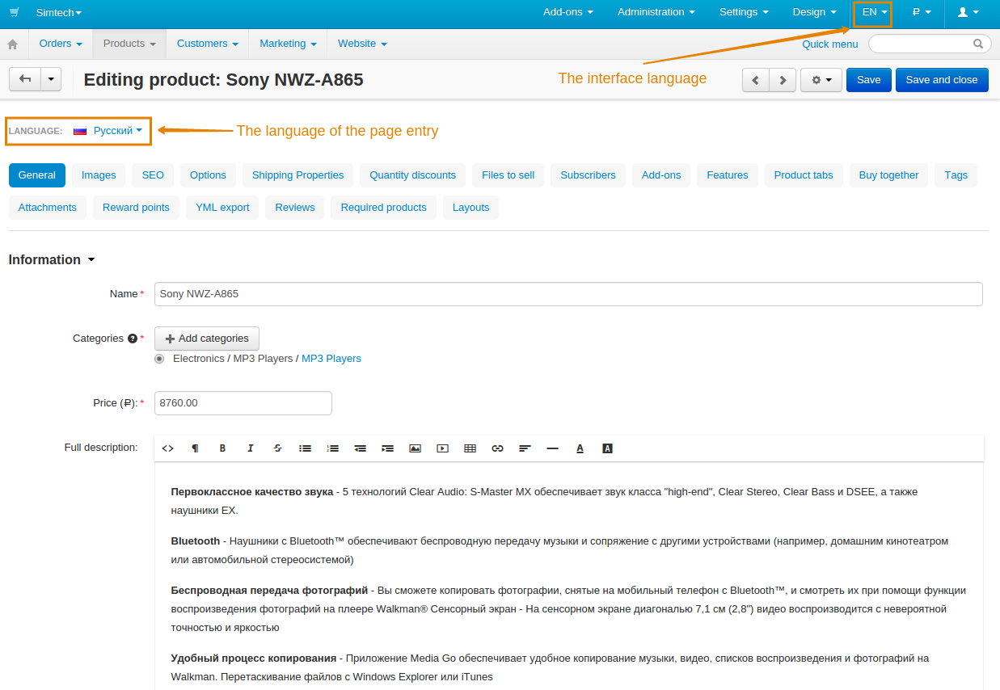

*********
Languages
*********

======================
Managing the Languages
======================

Manage the languages of your store under **Administration → Languages → Manage languages**. There are two tabs:

* **Installed**—the languages installed in your store.

* **Available**—the languages you can install.

Use the **gear** button of a language to clone, export or delete the language, or to edit its properties.

=====================
Installing a Language
=====================

To install a new language:

1. Go to **Administration → Languages → Manage languages**.

2. Switch to the **Available** tab.

.. image:: img/available_languages.png
    :align: center
    :alt: The available languages tab

3. Choose the desired language and click the **Install** button.

===============================
Interface and Content Languages
===============================

The language of the interface in the Administration panel and the language of edited content may differ. That comes useful if you sell products to people from different countries and want to change product descriptions or category names in a different language without switching to that language entirely.

* To change the interface language of the Administration panel: 

  1. Find the language code in the top right corner of the page.

  2. Click on it and choose the desired language from the menu.

* To change the language of content:

  1. In the Administration panel open the page of the desired object (e.g. a category, a product, etc.). 

  2. Click on the name of the language in the **Language** field at the top left corner of the object area.

  3. Choose the desired language.

===============
In this section
===============

.. toctree::
    :maxdepth: 4
    :titlesonly:
    :glob:

    contact_us_form
    translate

.. toctree::
    :maxdepth: 4
    :hidden:
    :glob:

    crowdin
