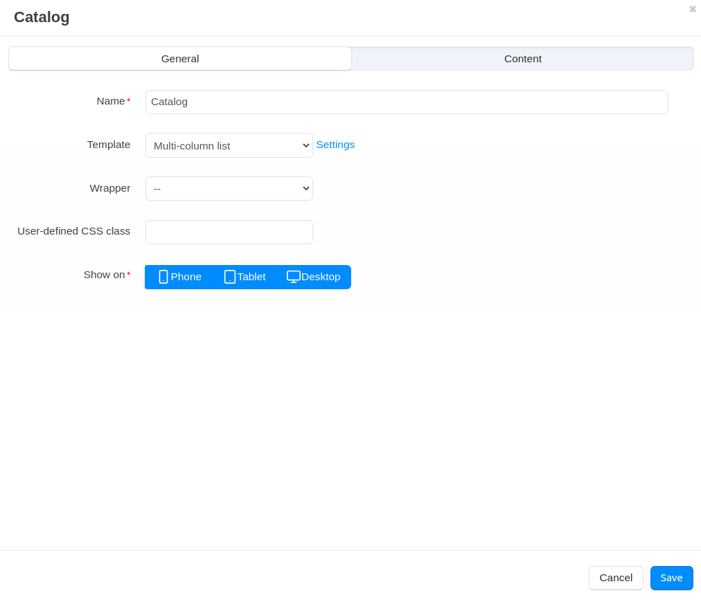
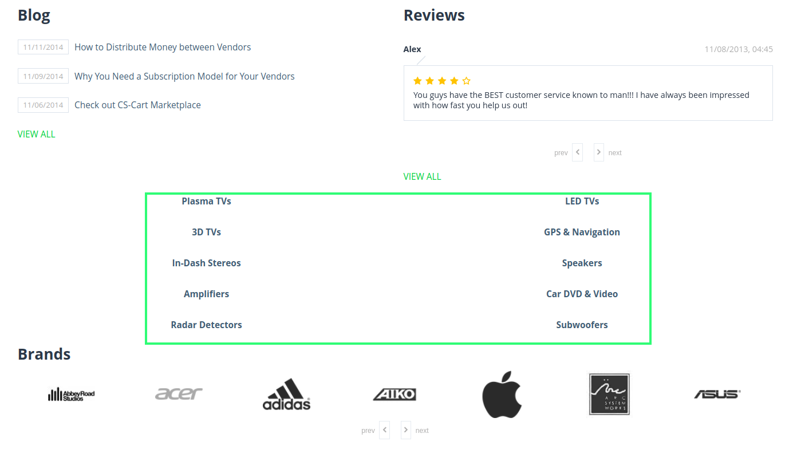

*****************************************************
How To: Arrange Categories on the Storefront Homepage
*****************************************************

You can arrange categories right on the storefront homepage. By using the **Categories** block you can create and add to the storefront the list of desired categories.

*	In the Administration panel, go to **Website → Themes → Edit layouts → Homepage**.
*	Click the **+** button in the necessary container and click **Add block**.
*	Open the **Create New Block** tab and in the opened section choose **Categories**.
*	In the opened section, specify the name of the new block (e.g. *Catalog*) and click the **Create** button.
*	Click on the gear icon of the created block and select:

	*	*Multi-column list* in the **Template** select box.
	*	*Mainbox general* in the **Wrapper** select box.

*	Click the **Settings** link and enter the desired number of columns in the appeared **Number of columns in the objects list** input field.
*	Specify the desired css-class in the **User-defined CSS-class** input field if needed.

*	Open the **Content** tab and select *Manually* in the **Filling** select box. Click **+ Add categories** to choose categories and select them with checkboxes, then click **Save**.

*	Click the **Save** button.

.. image:: img/arranging_categories2.png
    :align: center
    :alt: Content tab

.. note::

	After the block is created or changed, make sure it is displayed correctly. Sometimes not all wrappers are suitable for a specific block type.

This is how arranged categories look on the storefront:

