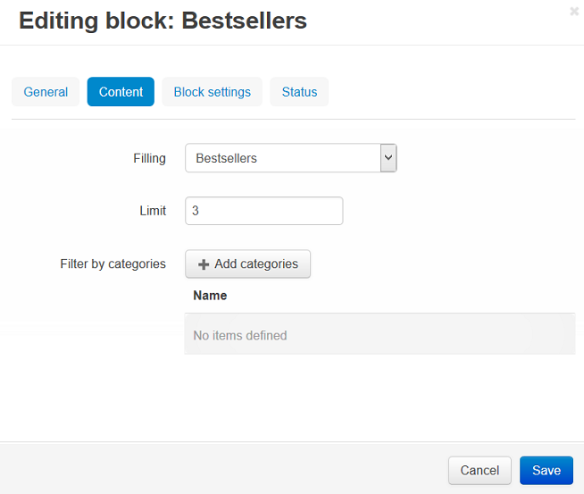

*************************************************
How To: Add the Bestsellers Block to the Homepage
*************************************************

*   In the Administration panel, go to **Add-ons → Manage add-ons**.
*   Enable the **Bestsellers & On Sale Products** add-on (change its status to *Active* in the select box on the right).
*   Go to **Design → Layouts → Homepage**.
*   Click the **+** button in the necessary container and click **Add block**. Open the **Create New Block** tab and click the **Products** button. In the opened window:

    *   Enter the block name (e.g. *Bestsellers*).
    *   Select *Products* in the **Template** select box.

	.. image:: img/add_block.png
	   	:align: center
	   	:alt: Add block

    *   Open the **Content** tab and select *Bestsellers* in the **Filling** select box.
    *   Click the **Create** button.

*   Drag and drop your block if you want to change its position relatively to other blocks.