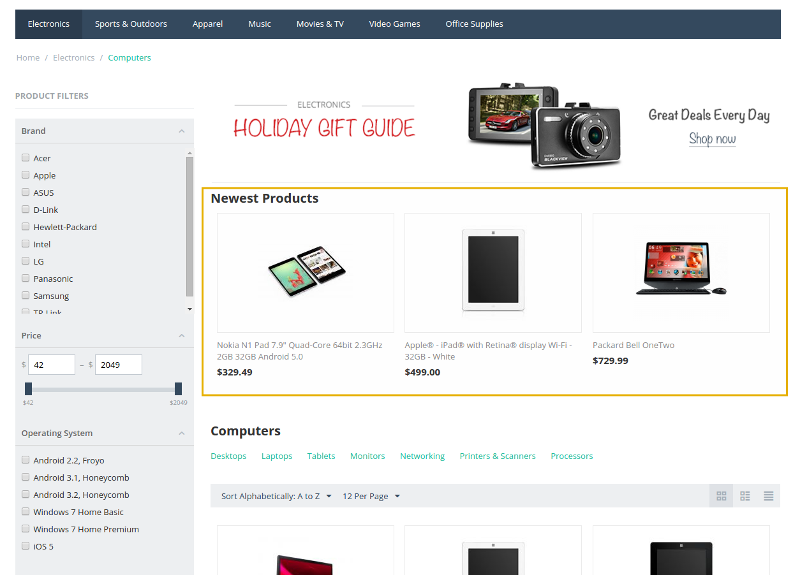

********************************************
How To: Display the Newest Products on Pages
********************************************

================================================
How To: Display the Newest Products on All Pages
================================================

To display the section of the newest products on all pages:

*   In the Administration panel, go to **Design → Layouts → Default**.
*   Click the **+** button in the necessary container and click **Add block**.
*   Open the **Create New Block** tab and in the opened section click the **Products** button.
*   In the opened section, specify the name of the new block (e.g. *Newest products*) and click the **Create** button.
*   Click on the gear icon on the created block and select:

    *   *Grid* in the **Template** select box.
    *   Desired wrapper in the **Wrapper** select box.
    *   Desired CSS-class in the **User-defined CSS-class** input field if needed.
    
*   Open the **Content** tab and select *Newest* in the **Filling** select box.
*   Click the **Save** button.

.. note::

	The **Newest products** block will be displayed on all store pages. If you do not want to display it on some pages (e.g. on the **Checkout** page), open the corresponding tab on the **Layouts** page (e.g. choose the **Checkout** tab at the top of the page) and change the block status to *Disabled* by clicking on the **Activate/Deactivate Block** icon. Sometimes the block might located in the Top Panel, Header, or Footer of the page, in that case on the desired tab click the **Set custom configuration** link and deactivate the block.

========================================================
How To: Display the Newest Products on the Category Page
========================================================

To display the section of the newest products on the category page:

*   In the Administration panel, go to **Design → Layouts → Categories**.
*   Click the **+** button in the necessary container and click **Add block**.
*   Open the **Create New Block** tab and in the opened section click the **Products** button.
*   In the opened section, specify the name of the new block (e.g. *Newest products*) and click the **Create** button.
*   Click on the gear icon on the created block and select:

    *   *Grid* in the **Template** select box.
    *   Desired wrapper in the **Wrapper** select box.
    *   Desired CSS-class in the **User-defined CSS-class** input field if needed.

.. image:: img/newest_01.png
    :align: center
    :alt: Content tab

*   Open the **Content** tab and select *Newest* in the **Filling** select box. Set up the necessary fields.
*   Click the **Save** button.

.. note::

	After the block is created or changed, make sure it is displayed correctly. Sometimes not all wrappers are suitable for the blocks.

