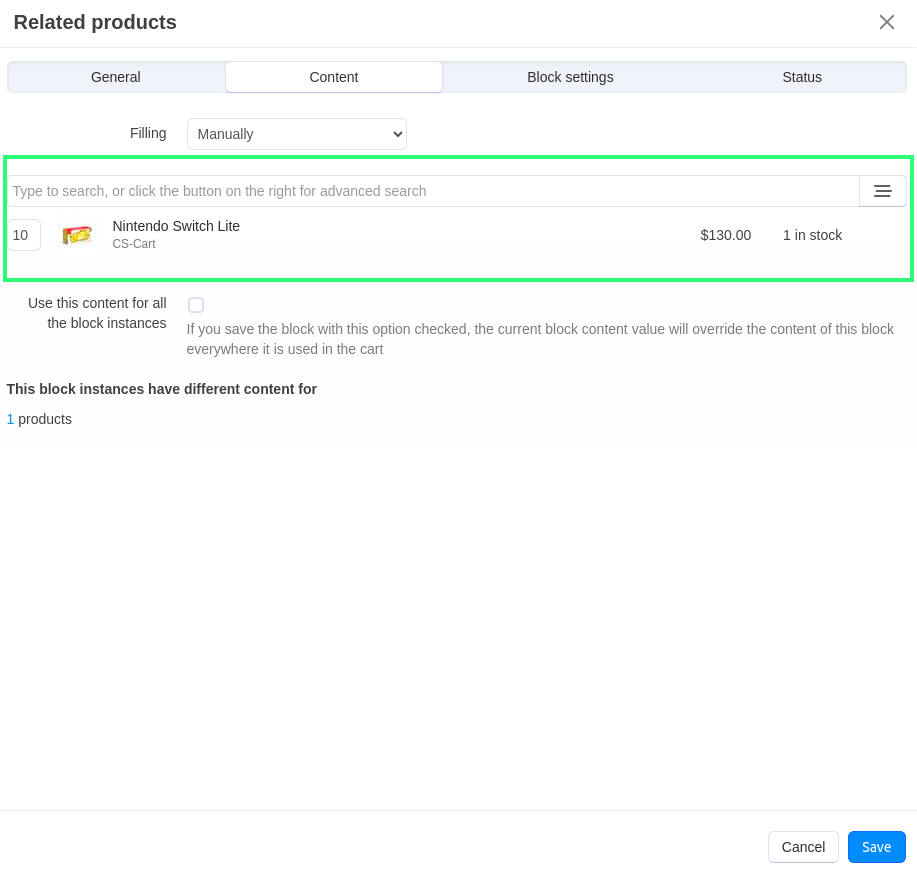
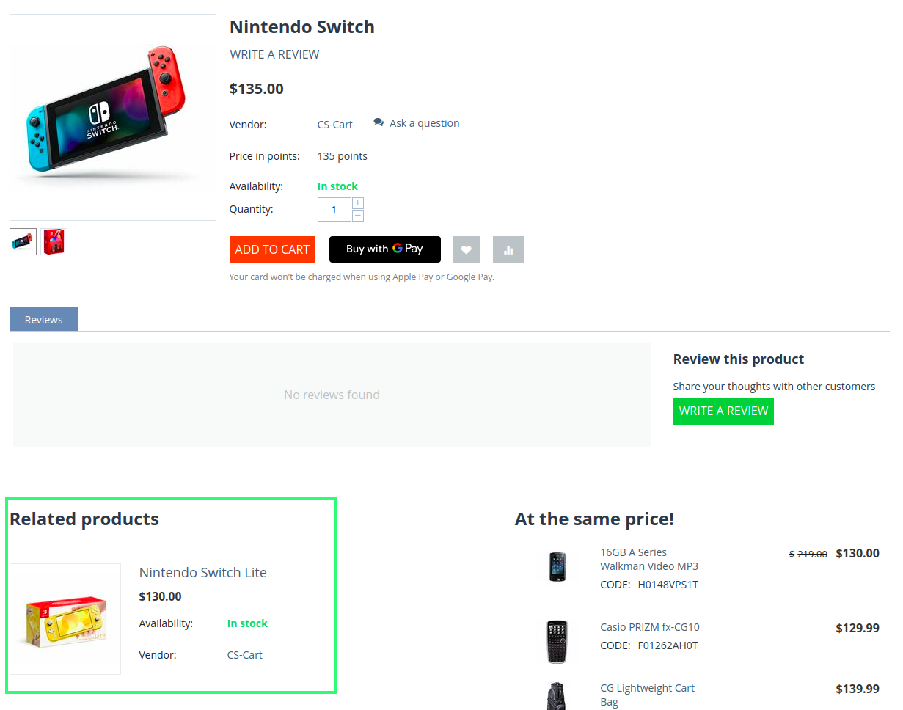

***********************************************************************
How To: Create the Related Products Section on the Product Details Page
***********************************************************************

The Related Products section displays the products that have something in common with the product selected. For example, gamepads and video games are related to game consoles; or TVs are related to Blu-Ray players and audio systems.

To create the **Related products** section on the product details page:

======================
Step 1. Create a Block
======================

*   In the Administration panel, go to **Website → Themes → Edit layouts → Products** tab.
*   Click the **+** icon in the necessary container and click **Add block**.
*   Open the **Create New Block** tab and in the opened section click the **Products** button.
*   In the opened section specify the name of the block (e.g. *Related products*) and click the **Create** button.
*   Click on the gear icon of the created block and select:

    *   *Products* in the **Template** select box.
    *   Desired wrapper in the **Wrapper** select box.
    *   Specify the desired css-class in the **User-defined CSS-class** input field.

    .. image:: img/related-1.png
         :align: center
         :alt: General tab

    *   Open the **Content** tab and select *Manually* in the **Filling** select box
    *   Click the **Save** button.

    .. image:: img/related-2.png
        :align: center
        :alt: Content tab

================================
Step 2. Add a Block to a Product
================================

*   Go to **Products → Products** and click on any product.
*   On the product details page, open the **Layouts** tab.
*   Related products block is active.
*   Click on the gear icon on the block and open the **Content** tab. Click in the search area and add the necessary products.
*	Click the **Save** button.

.. note::

	After the block is created or changed, make sure it is displayed correctly. Sometimes not all wrappers are suitable for a specific block type.

