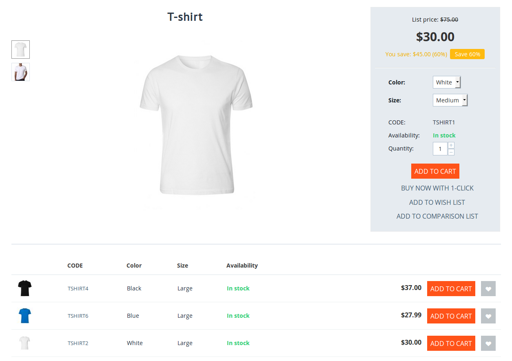

****************************************************
How To: Add a Block with Variations to Product Pages
****************************************************

CS-Cart and Multi-Vendor allow you to show all the existing :doc:`product variations </user_guide/manage_products/products/variations>` on the page of that product. Previously customers had to select different variants of options on the product page to see what was available and in stock. With the list of all variations on the product page, a customer will be able to:

* See what variations a product has, and which of these variations are in stock. 

* Add the necessary variations to cart or to the wish list right away.

.. important::

    The :doc:`Product Variations </user_guide/addons/product_variations/index>` add-on first appeared in version 4.6.1, but the ability to show all the existing variations on the product page wasn't available until version 4.7.1.

To add a block with variations on the product page:

#. Go to **Design → Layouts**.

#. Switch to the **Products** tab.

#. Click the **+** button of the necessary grid and choose the **Add block** action.

#. A pop-up window will open. Switch to the **Create New Block** tab and choose **Products**.

#. Choose *Variations* as the block's template. If you'd like to hide the **Add to wish list** button for variations, just click the **Setting** link and tick the corresponding checkbox.

   .. image:: img/variations_template.png
       :align: center
       :alt: The Variations template.

#. Switch to the **Content** tab and choose *Variations* as the filling. Specify the limit (the maximum number of displayed variations) and choose whether you'd like to show only the variations that are in stock.

   .. important::

       If you'd like all variations of a product appear in the block, leave the **Limit** field empty.

   .. image:: img/variations_filling.png
       :align: center
       :alt: The Variations filling type.

#. Click the **Create** button. Now, if a product has variations, the list of these variations will appear on the product page.

#. (optional) :doc:`Create a product tab </user_guide/look_and_feel/tabs/new_tab>` and put a block with variations into that tab, if you'd like the list of variations to be displayed on a separate tab or in a pop-up window. In this case, remember to disable the block that you added to the product page in step 4 of this tutorial.

   .. image:: img/variations_as_popup.png
       :align: center
       :alt: The Variations block as a pop-up.
