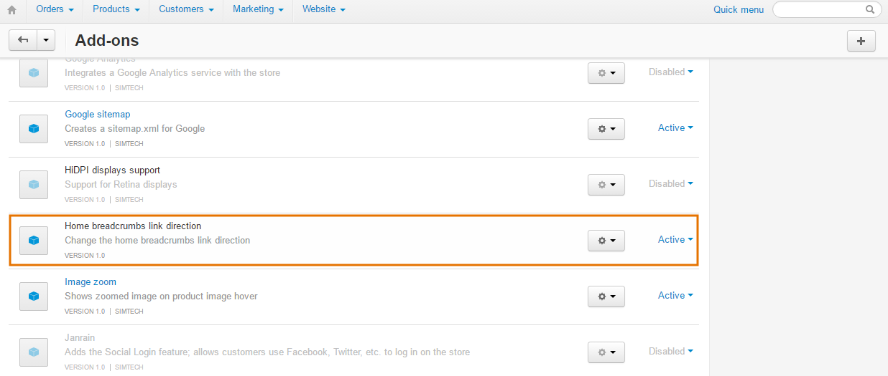

******************************************************
How To: Change Destination of Home Link in Breadcrumbs
******************************************************

:doc:`Breadcrumbs <index>` have the *Home* link, that leads to the index page of your store. To change where the *Home* link leads, use our free add-on.
 
=============================
Step 1. Installing the Add-on
=============================

1. Download the **Home Breadcrumbs Link Direction** add-on using `this link. <https://github.com/cscart/addon-breadcrumbs-home-link/archive/master.zip>`_ You'll get a ZIP archive.

.. note::

   You are also welcome to visit `the add-on's repository on GitHub. <https://github.com/cscart/addon-breadcrumbs-home-link>`_

2. Log in to the Administration panel of your store.

3. Go to **Add-ons → Manage add-ons**.

4. Сlick the **+** button to upload the add-on.

.. image:: ../../changing_attributes/img/addons_plus_button.png
    :align: center
    :alt: Add-ons plus button

5. In the pop-up window click **Local**, and choose the ZIP archive you downloaded earlier.

6. Click **Upload & install**.

.. important::

    Another way is to unpack the archive and copy the content of the resulting folder to the root directory of your store on the server. Then go to **Add-ons → Manage add-ons**, choose **Browse all available add-ons** and install the add-on.

.. image:: ../../changing_attributes/img/upload_and_install_addon.png
    :align: center
    :alt: Upload and install pop-up

====================================
Step 2. Choose Home Link Destination
====================================

1. Find **Home Breadcrumbs Link Direction** on the list of add-ons and click on the add-on's name.

2. You'll see only one setting: **The home link of your store**. Replace *http://www.domain.com* with the desired destination for the home link, for example, *http://example.com/mypage*.

3. Click **Save**. Now *Home* will lead to *http://example.com/mypage*.
