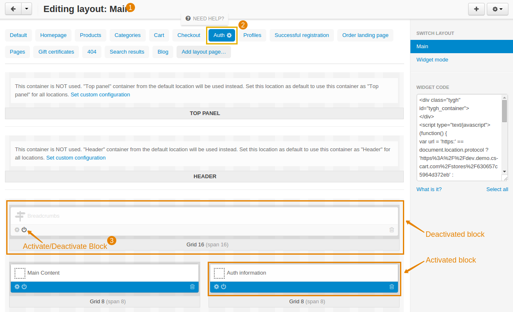

************************
How To: Hide Breadcrumbs
************************

To disable breadcrumbs in the storefront, do the following:

1. In the Administration panel, go to **Design → Layouts**.

2. Click the tab of the layout page, where you want to disable breadcrumbs. 

   .. note::

       If the page is not in the layout pages list, click the **Default** layout page.

3. Click the **Activate/Deactivate Block** icon of the **Breadcrumbs** block. The block should become lighter.

4. Repeat these steps for all layout pages where you want to disable breadcrumbs.

.. image:: img/breadcrumbs_04.png
    :align: center
    :alt: Deactivated block on the storefront
