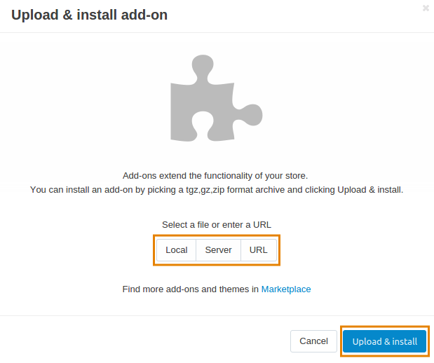
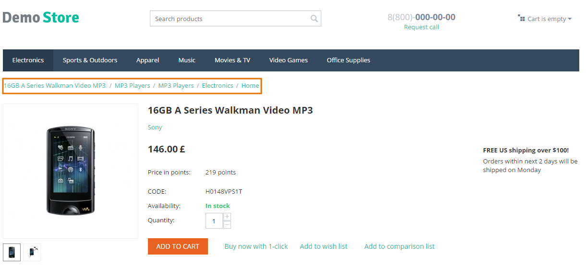

*********************************************
How To: Reverse the Word Order of Breadcrumbs
*********************************************

Use the **Reverse Breadcrumbs** add-on for this purpose .

To get and install this add-on, follow the steps below:

1. Download the Reverse Breadcrumbs add-on archive using `this link <https://github.com/cscart/addon-breadcrumbs-reverse/archive/master.zip>`_.

.. note::

    If you want to check the add-on code, please, visit `the add-on page on GitHub <https://github.com/cscart/addon-breadcrumbs-reverset>`_.

2. Log in to the Administration panel of your store.

3. Go to **Add-ons → Manage add-ons**.

4. Сlick the **+** button to upload the add-on.

.. image:: ../../changing_attributes/img/addons_plus_button.png
    :align: center
    :alt: Add-ons plus button

5. In the pop-up window click **Local**, and choose the add-on archive.

6. Click **Upload & install**.

The Reverse Breadcrumbs add-on is installed and ready for work.

.. image:: img/reverse_word_order_01.png
    :align: center
    :alt: The Reverse Breadcrumbs add-on

.. note::

    The breadcrumbs will be automatically reversed immediately after the add-on was installed and activated.

.. note ::

    If you have installed the add-on but the changes are not displayed, please try clearing the template cache. In order to do it, in the Administration panel of your store go to **Administration → Storage → Clear cache**.
