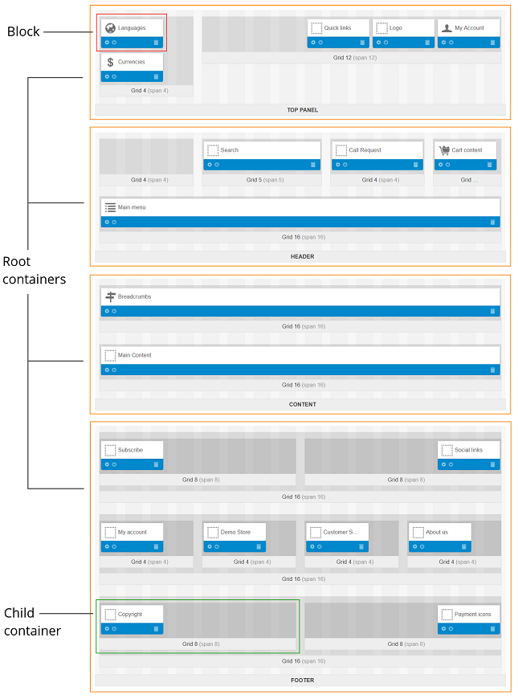

*********
Framework
*********

.. warning::

    This article may no longer be relevant or up to date. Please :doc:`return to the main page of the section. <index>`

==========
Containers
==========

---------------
Root containers
---------------

The basic framework of the storefront consists of four horizontal **root containers**:

* **Top Panel**

* **Header**

* **Content**

* **Footer**

Root containers cannot be added or removed. This basic frame is the same for all layouts.

.. important::

    The **Top Panel**, **Header**, and **Footer** containers of the :doc:`default layout page<../layout_pages/index>` are inherited by other layout pages. The changes that you make to these three areas automatically apply to all layout pages.

Each root container is associated with a particular area of the storefront page—header, main content area, or footer. However, root containers themselves do not generate the corresponding parts of the storefront pages. In fact, they only accommodate and form boundaries for multiple smaller containers referred to as **child containers**.

.. note::

    Although a root container may consist of zero child containers, you are supposed to include at least one.

----------------------------------
Child Containers: Grids and Blocks
----------------------------------

Child containers (also known as **grids**) allow for more detailed and sophisticated layouts of storefront pages. Multiple grids with certain sizes, positions, and styles can be nested inside a root container or inside other grids. Each grid may include one or more **blocks**—boxes with information of certain type.

To add a grid:

1. Click the **+** icon on the container that will be the parent on the new container and select **Add grid**.

2. You'll see a form. Specify the properties of the new container there:

   * **Width**—the number of columns used in the container. For child containers, this number cannot exceed the the length of the root container (see *Bootstrap Grid System* below).

   * **Content alignment** (for child containers only)—the position of the container inside the root (or parent) container: *Right*, *Left*, or *Full Length*.

   * **Offset**—the number of non-occupied buffer columns.

   * **User-defined CSS class**—a custom CSS class used by the container.

3. Click **Create**, and a grid or block will be created. 

.. image:: img/add_grid.png
    :align: center
    :alt: Container settings

=====================
Bootstrap Grid System
=====================

CS-Cart uses the intuitive and powerful `Bootstrap <http://getbootstrap.com/>`_ framework that allows full-, custom-width, and responsive layouts. A layout in CS-Cart can have 12 or 16 columns.

In the full-width layout the length of the columns is adapted to the width of the page. In custom-width layout the length of the columns is fixed and depends on the specified width of the page. A responsive layout is flexible and adapts easily for different screen sizes. It is very useful for displaying site content on portable devices.

In CS-Cart, the root containers always occupy the full page length, i.e. all columns of the layout. The number of columns is defined through the container settings. It determines the possible dimensions of child containers. Their length cannot exceed the number of columns of the layout.

.. toctree::
    :maxdepth: 4
    :hidden:

    container_properties
    grid_system
