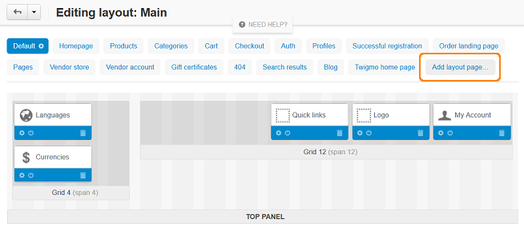
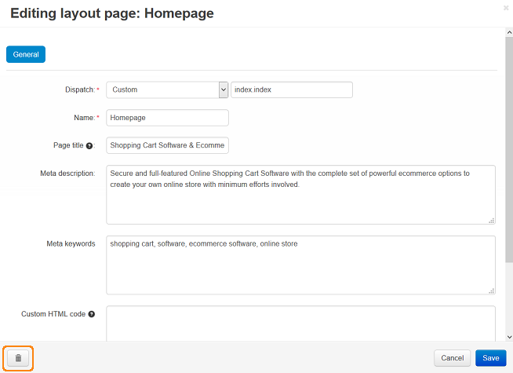

***********************
Actions on Layout Pages
***********************

Layout pages are not hard-coded or limited in any way. You can have as many layout pages as you need. However, the default set of layout pages is usually enough.

.. note::

    All actions on layout pages are performed in the Administration panel of your store under **Design → Layouts**.

===============
General actions
===============

--------------------
Adding a Layout Page
--------------------

1. In the list of layout pages, choose the **Add layout page** tab.

2. A pop-up window will open. Specify :doc:`the properties of the new layout page. <layout_page_attributes>`

3. Click the **Create** button.

----------------------
Removing a Layout Page
----------------------

1. Select a layout page and click the **gear** icon next to its name.

.. image:: img/layout_page_02.png
    :align: center
    :alt: Edit layout page

2. Click the **trash can** button in the pop-up window that opens.

3. Click **Ok**.

   .. warning::

       You can't undo this action, unless you export this layout in advance and import it afterwards.

------------------------------
Editing Layout Page Properties
------------------------------

1. Select the layout page and click the **gear** icon on the tab. 

2. You'll see a form where you can edit :doc:`layout page properties <layout_page_attributes>`.

3. When you're done, click **Save** to apply changes.

=================
Export and Import
=================

Layout pages can be imported and exported in an XML file. This is useful when you need to clone the layout to other storefronts.

We recommend that you export layout pages before making any changes to the storefront layout. That way you can always restore the original layout by importing the layout pages.

.. important::

    The import and export of layout pages doesn't take into account the state of the layout page for a certain object (such as product, category, page, etc.). If a block is disabled for a certain object, that information won't be imported and exported.

----------------------
Exporting Layout Pages
----------------------

1. Click the **gear** button in the upper right part of the screen and choose **Export Layout**. 

2. A pop-up window will open. Configure the export settings there:

   * **Layout pages**—select the layout pages to be exported.

   * **Output**—output type: 

     * *Direct download*—the XML file will be downloaded to you computer; 

     * *Server*—file will be saved on the server where CS-Cart is installed; 

     * *Screen*—file contents will be displayed on the screen.

   * **File name**—name of the exported file. By default, it is *layouts_<TIMESTAMP>.xml*.

3. Click **Export**.

----------------------
Importing Layout Pages
----------------------

1. Click the **gear** button in the upper right part of the screen and choose **Import layout**. 

2. A pop-up window will open. Configure the import settings there:

   * Choose the file that will be imported or enter its URL.

   * Choose whether to create new layout or update current one.	If you have chosen to update current layout, specify the other settings:

     * **Clean up layout pages before import**—if you tick this checkbox, all original layout pages will be deleted before the import.

     * **Override layout pages by dispatch**—if you tick this checkbox, existing layout pages  will be replaced with the layout pages from the XML file with the same dispatch. Other imported layout pages will be simply added.

3. Click **Import**.
