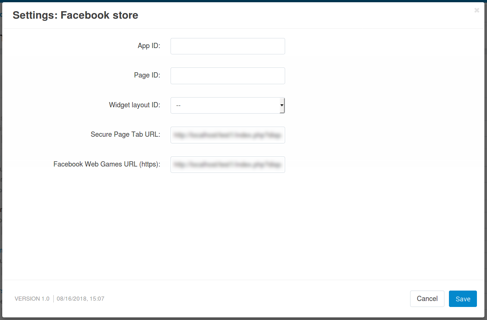
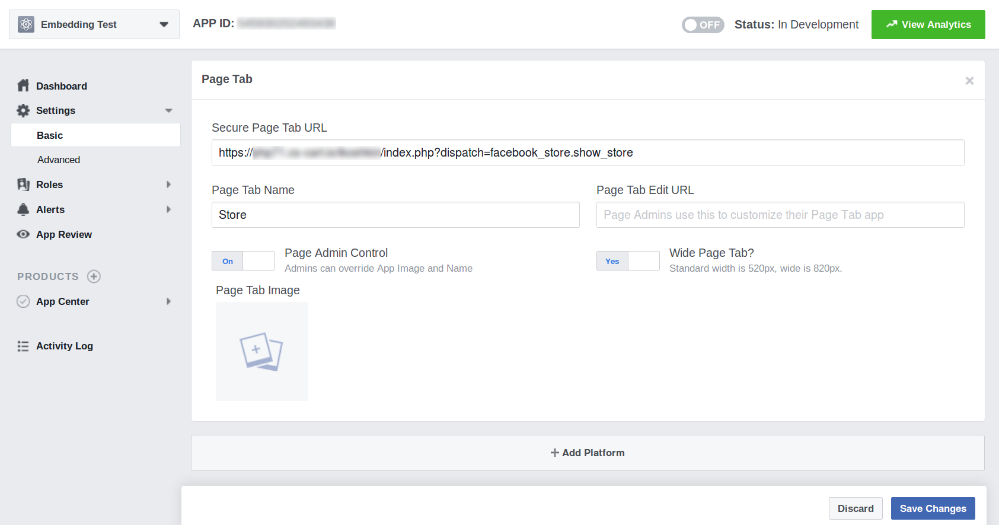
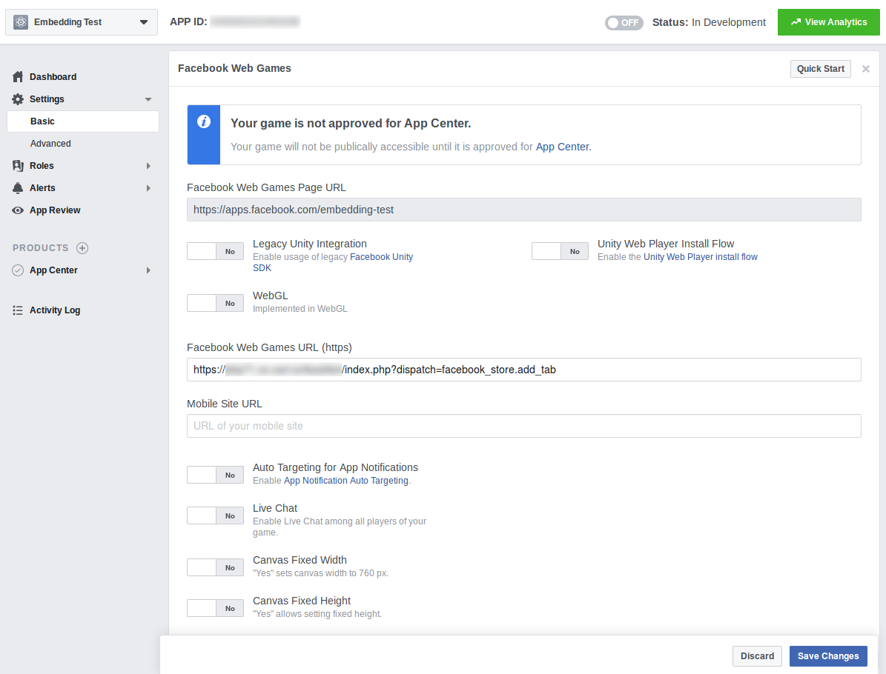
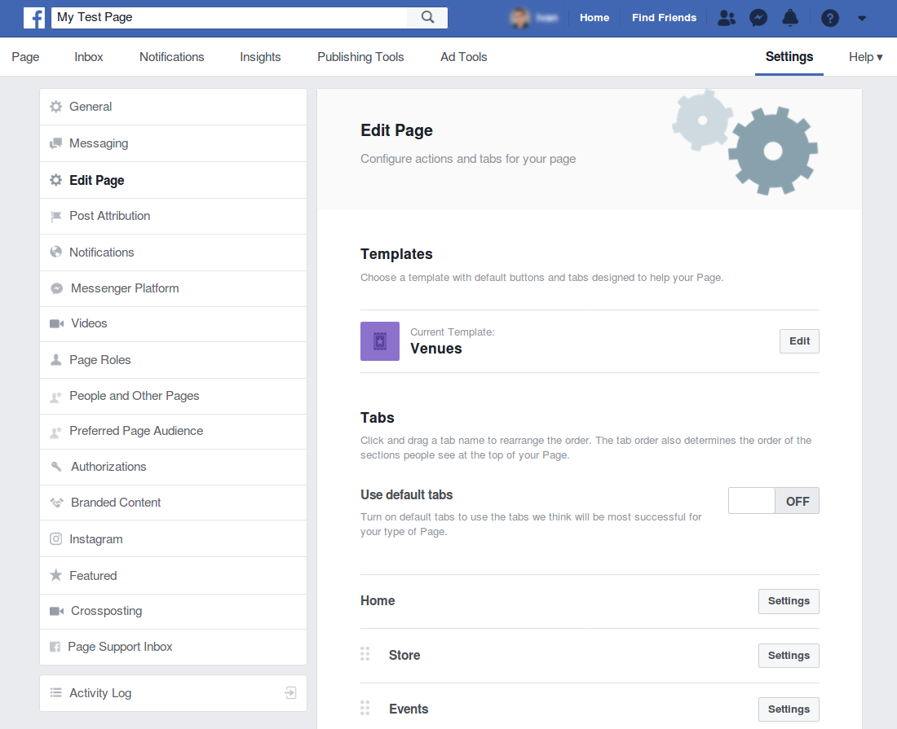

******************************************
How To: Embed a Store into a Facebook Page
******************************************

.. note::

    The add-on described in the article works only with CS-Cart/Multi-Vendor 4.8.2 and newer versions. Your store will need a working SSL certificate; once you install the certificate, go to **Settings → Security settings** and change the value of the **Enable secure connection for the storefront** setting to *Secure full site*.

A CS-Cart or Multi-Vendor store can be embedded into a Facebook page. To do that, you'll need to create your own Facebook application and install an add-on to your store; that add-on will link the store to the application. Once you configure the add-on and your Facebook app, your store will appear on Facebook and will be able to accept orders from there.

.. image:: img/embedded_store_in_facebook.png
    :align: center
    :alt: A CS-Cart store embedded into a tab on a Facebook page.

.. note::

    We have a `CS-Cart demo store on Facebook <https://www.facebook.com/cscart.official/app_457462450989458>`_. We don't sell anything there, but at least it shows how embedding works.

=========================================
Step 1. Install the Facebook Store Add-on
=========================================

1.1. The **Facebook Store** add-on is free, but it doesn't come with CS-Cart and Multi-Vendor by default; instead it is available `on GitHub <https://github.com/cscart/addon-facebook-store>`_. Here is `a direct link to the archive with the add-on <https://github.com/cscart/addon-facebook-store/archive/master.zip>`_. Download the archive to your device or just copy the link.

1.2. Install the add-on :doc:`as described in the documentation </user_guide/addons/1manage_addons>`. During installation you can either upload the archive from your device, or specify the URL from step 1.1.

1.3. **Facebook Store** will appear among the installed add-ons. Find the add-on and click on its name to open the settings.

* **App ID** must be entered manually; you'll find it in your app on Facebook. We'll be creating the app in step 2.

* **Page ID** will be filled in automatically once you configure everything. It is the identifier of the page where the tab with your store will be added.

* **Widget layout ID** can be selected now. It is the :doc:`layout </user_guide/look_and_feel/layouts/index>` that will be used by your Facebook store.

* **Secure Page Tab URL** and **Facebook Web Games URL (https)** will have to be entered into the corresponding fields on the Facebook side during the app configuration.

You'll have to specify the settings and click the **Save** button for the add-on to work. Step 2 will explain how to configure everything, so you may leave the add-on settings open for the time being.

=====================================
Step 2. Configure the App on Facebook
=====================================

2.1. `Create your Facebook application <https://developers.facebook.com/apps/>`_. You can use any name you like for the app.

2.2. You'll be taken to the app page. The ID can be found at the top of the page; copy it and paste it to the **App ID** field of the **Facebook Store** add-on settings.

2.3. Go to **Settings > Basic** in your Facebook app:

* Specify the **Namespace**; it will appear in the URL of the app, and your customers won't see it. For example, we called it *embedding-test*.

* Enter the domain of your store in the **App Domains** field.

.. image:: img/basic_app_settings.png
    :align: center
    :alt: The basic settings of a Facebook app.

2.4. Click the **Add Platform** button at the bottom of the page and choose **Page Tab**. This will add another section with settings to your app:

* Copy the value of **Secure Page Tab URL** from the add-on's settings and paste it to the corresponding field in your Facebook app settings.

* Enter the desired page tab name into the corresponding field. Customers will see that name on your Facebook page.

2.5. Click the **Add Platform** button again and choose **Facebook Web Games**. This will add another section with settings to your app:

* Copy the value of **Facebook Web Games URL (https)** from the add-on's settings and paste it to the corresponding field in your Facebook app settings.

* Disable any other settings for this platform.

2.6. Save the changes in your app and in the add-on settings, then open a separate tab in the browser and follow the link from the **Facebook Web Games Page URL** field of the Facebook app settings.

2.7. Click **Select page** if you already have a Facebook page where you'd like to show your store.

.. hint::

    If you haven't created a Facebook page for the store yet, do it by following `this link <https://www.facebook.com/pages/create/>`_.

.. image:: img/select_page_for_store.png
    :align: center
    :alt: Choosing a Facebook page for embedding the store.

2.8. Choose the desired page from the dropdown list and click **Add Page Tab**. After this, the store should appear on the specified page in Facebook. The settings of the **Facebook Store** add-on will now include **Page ID**.

.. image:: img/add_page_tab.png
    :align: center
    :alt: Choosing a Facebook page for embedding the store.

=====================================
Step 3. Customize Your Facebook Store
=====================================

You can change the order of tabs on a Facebook page. This is done by dragging the tabs on the Facebook end in the page settings under **Settings > Edit Page**.

You can also change your Facebook store appearance right from your CS-Cart admin panel:

* **Design → Themes**—pick a visual style for your storefront: colors, fonts, etc.

* **Design → Layouts**—re-arrange the :doc:`blocks </user_guide/look_and_feel/layouts/blocks/index>` of your storefront.

  .. note::

     If you use your default :doc:`layout </user_guide/look_and_feel/layouts/widget_mode/index>` for the Facebook store, these changes will affect your main store too.

CS-Cart's **Responsive** theme has a built-in Facebook style designed to blend into Facebook's interface.

