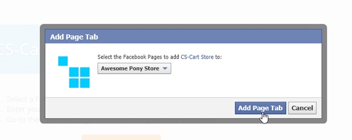
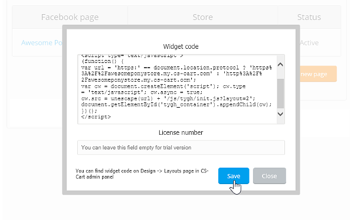

******************************************
How To: Embed a Store into a Facebook Page
******************************************

`CS-Cart Facebook App <https://apps.facebook.com/cscart-store/>`_ allows you to embed an existing CS-Cart or Multi-Vendor store into a Facebook page in a matter of minutes.

.. important::

    According to the Facebook regulations, your CS-Cart or Multi-Vendor storefront must be :doc:`accessible via HTTPS <../../../settings/security_settings>` to be able to be embedded to a Facebook app.

The app works similarly to :doc:`the Widget Mode <index>`: you just copy a few lines of code, paste them on the app page, and specify the Facebook page where you want the store embedded.

Your store will immediately appear on the specified Facebook page as a new app, ready for work right away.

.. image:: img/embedded_store_in_facebook.png
    :align: center
    :alt: An embedded CS-Cart store as it appears on a Facebook page.

This is a great way to get closer to your store’s audience and draw more customers.

.. note::

    Check out `CS-Cart demo store on Facebook. <https://www.facebook.com/cscart.official/app_457462450989458>`_

=============================================
Step 1. Select a Facebook Page for Your Store
=============================================

1.1. Go to the `app page on Facebook <https://apps.facebook.com/cscart-store/>`_ and click the **Select page** button.

.. image:: img/select_page_for_store.png
    :align: center
    :alt: Choosing a Facebook page for CS-Cart store.

1.2. Pick the page you want to add the store to and click **Add Page Tab**.

1.3. The page will reload and you’ll see a table with your Facebook store with status *Pending*.

============================
Step 2. Copy the Widget Code
============================

2.1. Open the Administration panel of your store in another tab.

2.2. Go to **Design → Layouts** and copy the widget code from the layout you want to use in your Facebook store.

.. note::

    Although you can use your default :doc:`layout <../index>` for Facebook, you might want to use a separate layout: that way you'll be able to change the look of your main store and Facebook store separately. 

.. image:: img/widget_01.png
    :align: center
    :alt: Getting the widget code from CS-Cart.

2.3. Back on the CS-Cart Facebook App page, click **Set store**, paste the code into the **Widget** code box, and click **Save**.

That’s it! Now, your store is available right in your Facebook page, ready to take and process orders.

=====================================
Step 3. Customize Your Facebook Store
=====================================

You can also change your Facebook store appearance right from your CS-Cart admin panel:

* **Design → Themes**—pick a visual style for your storefront.

* **Design → Layouts**—re-arrange the :doc:`blocks <../blocks/index>` of your storefront. 

  .. note::

     If you use your default :doc:`layout <../index>` for the Facebook store, these changes will affect your main store too.

CS-Cart has a built-in Facebook storefront style that will help your store blend in perfectly.
