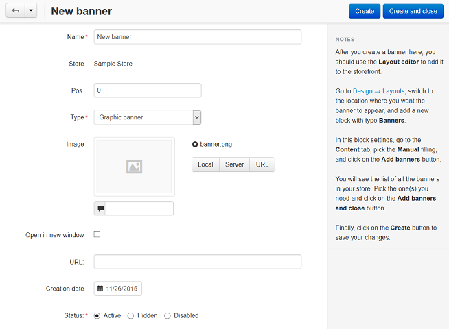
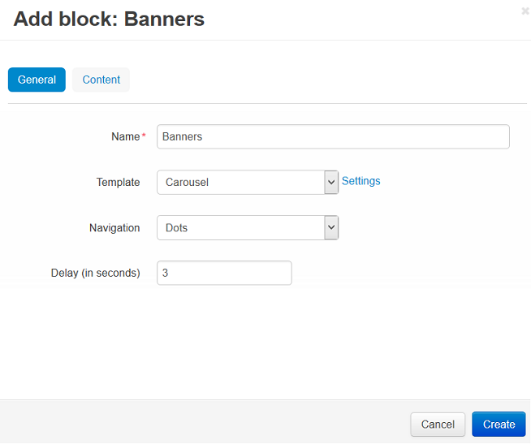

************************************
How To: Add a Banner to the Homepage
************************************

=======================
Step 1. Create a Banner
=======================

1. Go to **Marketing → Banners** in the Administration panel of your store.
2. Click the **+** button on the right and in the new page:

   * Specify the **Name** of the banner (e.g. *New banner*).

   * In the **Type** select box select *Graphic banner*.

   * Upload an image for the banner.

   * Tick the **Open in new window** (graphic banner only) checkbox, if you want the URL under the banner to be opened in a new window/tab.

   * If needed, specify the URL to which the banner is linked in the **URL** (graphic banner only) field. 
    
3. Click the **Create and close** button.

======================================
Step 2. Add the Banner to the Homepage
======================================

To make a banner appear on the homepage, you'll need to create a block for banners there first.

1. Go to **Design → Layout** and switch to the **Homepage** tab.
2. Click **+** in the desired container and choose **Add block**. 
3. Go to the **Create new block** tab and choose **Banners**. In the new window:

   * Specify the **Name** of the block (e.g. *Banners*).
   * Select *Carousel* in the **Template** select box and click the **Settings** link next to it:

     * **Navigation** — choose how a visitor can switch between the banners in the storefront.
     * **Delay (in seconds)** — set how quickly the banners change.

4. Go to the **Content** tab and choose *Manually* as **Filling**. 
5. Click **Add banners** and choose banners you want to display in the storefront. Click **Add banners and close**.
6. Click the **Create** button.

.. image:: img/banner_03.png
    :align: center
    :alt: Content
