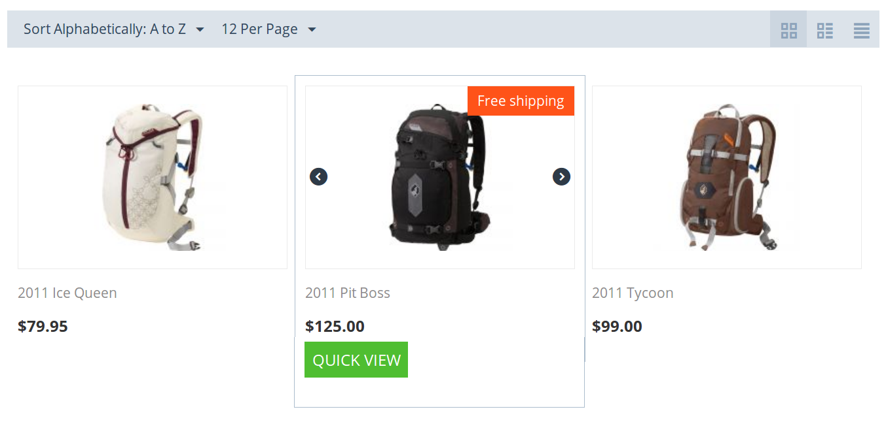

***********************************************************
How To: Display Free Shipping Label on Product Details Page
***********************************************************

You can display an appropriate label on the product details page when a product has the **Free shipping** setting turned on. This is done via an add-on that we provide for free.

.. note::

    The add-on is designed for the **Responsive** theme, which is the default theme of CS-Cart and Multi-Vendor.

============
Installation
============

1. Download one of the versions of the add-on:

   * `Display an image label for products free shipping. <https://github.com/cscart/addon-free-shipping-label/archive/image.zip>`_

   * `Display a text label for products with free shipping. <https://github.com/cscart/addon-free-shipping-label/archive/text.zip>`_

   .. note::

       The add-on will be downloaded from GitHub. If you want to see the code, feel free to visit `the GitHub repository <https://github.com/cscart/addon-free-shipping-label/>`_. The two variants of the add-on are stored in separate branches.

2. Log in to the Administration panel of your store.

3. Go to **Add-ons → Manage add-ons**.

4. Click the **+** button to upload and install the add-on.

.. image:: ../changing_attributes/img/addons_plus_button.png
   :align: center
   :alt: The plus button allows you to upload the add-on and install it.

5. In the pop-up window click **Local** and choose the add-on archive that you downloaded.

6. Click **Upload & install**. After this the add-on should be ready to work.

.. important::

    Another way is to unpack the archive and copy the content of the resulting folder to the root directory of your store on the server. Then go to **Add-ons → Manage add-ons**, choose **Browse all available add-ons** and install the add-on.

.. note ::

    If you have installed the add-on but the changes are not displayed, try :doc:`clearing the template cache <../../../../developer_guide/getting_started/cache_clearing>`.

.. image:: ../changing_attributes/img/upload_and_install_addon.png
   :align: center
   :alt: The addons you add via the plus button are uploaded and installed automatically.

=============
Customization
=============

After you install the add-on, you may want to customize it, so that it better suits your needs. Here is what you can do.

----------------
Change the Image
----------------

.. note::

    This applies to the `Free Shipping Label (Image) <https://github.com/cscart/addon-free-shipping-label/tree/image>`_ add-on.

The image that appears on the pages of products with free shipping is called **free_shipping_label.png**. It is located in *design/themes/responsive/media/images/addons/free_shipping_label_image/*. You can replace it with any image you like, as long as you keep the name **free_shipping_label.png**.

---------------
Change the Text
---------------

.. note::

    This applies to the `Free Shipping Label (Text) <https://github.com/cscart/addon-free-shipping-label/tree/text>`_ add-on.

The text that appears on the pages of products with free shipping is taken from the language variable called ``free_shipping``. That's why the text can differ from language to language. 

To change the value of this language variable:

1. Open the Administration panel and go to **Administration → Languages → Translations**.

2. Type *free_shipping* in the search bar on the right and click **Search**.

3. If you have multiple languages, select the language in the top left corner.

4. Change the value of the ``free_shipping`` language variable.

5. Click **Save**. 

.. important::

    The ``free_shipping`` language variable exists in CS-Cart and Multi-Vendor by default. Changing it also changes the name of the **Free shipping** product setting.

If you don't want to change a core language variable, you can also create your own language variable with the **+** button.

Let's call that variable ``example``. To use it in the add-on, replace ``__('free_shipping')`` with ``__('example')`` in *design/themes/responsive/templates/addons/free_shipping_label_text/hooks/index/scripts.post.tpl*.
