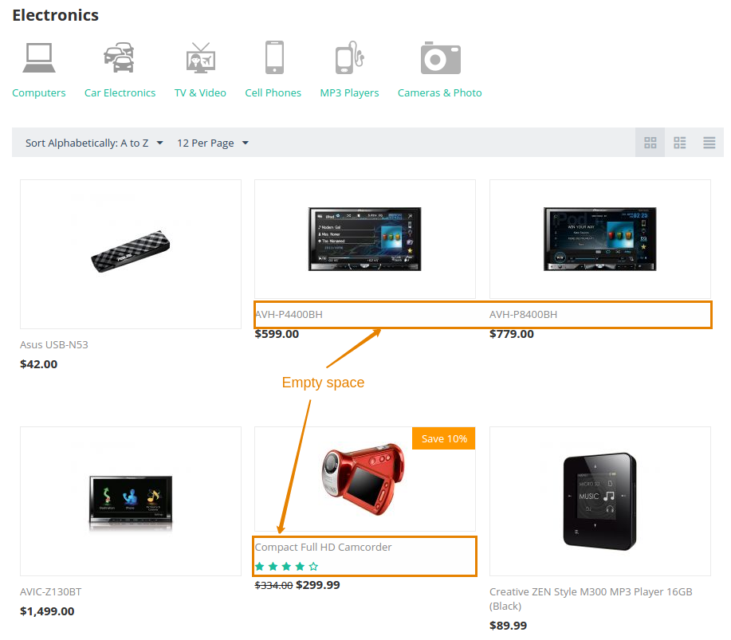

*********************************************
What Images Are the Best for My Online Store?
*********************************************
	
There are no strict limitations on the size and format of uploaded images. However, we can give some recommendations for faster page loading and more correct images display.

We do not recommend uploading overly large images—they need a lot of server space and increase hosting fees. Also, large images increase page load time. This can lead to users leaving without waiting for the page to load.

The recommended size of uploaded images is ranging from 300x300 to 600x600px, depending on the type of image. The image should not be larger than 3000px by the largest side. The image size on the disk should not exceed 1-2 MB. Otherwise, there may be problems with changing the image size in the Administration panel.

We recommend using web-optimized images in your store. You can find `many optimization addons on the CS-Cart Marketplace <https://marketplace.cs-cart.com/?subcats=Y&pcode_from_q=Y&pshort=Y&pfull=Y&pname=Y&pkeywords=Y&search_performed=Y&q=images+optimization&dispatch=products.search>`_. If you use `CS-Cart cloud hosting <https://www.cs-cart.com/cloud-hosting.html>`_, you can optimize images in your hosting account.

You don’t have to use your own online store to check edited pictures. `A free online demo version of a CS-Cart store <https://demo.cs-cart.com>`_ is always available.

.. contents::
   :backlinks: none
   :local:

=====================================
How to Get the Correct Size of Image?
=====================================

There are numerous online tools you can use for image editing. Here are some of them:

* `PicMonkey <https://www.picmonkey.com/home>`_;
* `Pixlr <https://pixlr.com/ru/>`_;
* `FotoFlexer <https://fotoflexer.com/>`_.

You can also use offline graphic editors such as `GIMP <https://www.gimp.org/>`_ or `Adobe Photoshop <https://www.adobe.com/products/photoshop.html>`_. The latter allows you to optimize multiple images at once through the **File → Save for web** feature.

The free add-on `Detailed Images Size <https://marketplace.cs-cart.com/detailed-images-size.html>`_ can help you to resize product detailed images during image upload.

=======================================
How to Resize Images on the Storefront?
=======================================

CS-Cart doesn't show images in their original form. Product photos are shrinked in size after uploading to the online store. Then thumbnails are generated automatically from the uploaded images. You can set the target image size on different pages (catalog, shopping cart, product card, etc.) on the **Settings → Thumbnails** page.

.. important:: 
  
	We recommend to specify only one of the thumbnail dimensions (width or height) for each of the thumbnails to keep an orderly look of the product list.

===============================
How to Choose the Image Format?
===============================

There are three common file formats for publishing images on the Internet: JPEG, GIF, and PNG. Each of them affects the image differently:

* **JPEG (.jpg)** is the most common image format on the Internet. JPEG images can be considerably compressed without losing quality. 

* **GIF (.gif)** images are lower quality than JPEG images. This format is used for more simplistic images, such as icons and decorative images. GIFs also support animation.

* **PNG (.png)** images are a popular alternative to GIF and JPEG . PNGs support many more colors than GIFs, and they don't degrade over time with re-saves, like JPEGs do. But the file sizes can still be much larger than JPEG images.

Here are some tips to remember when choosing file types:

* In most cases in ecommerce, JPEG is the best image format.
* Never use GIFs for large images. It will greatly increase the file size.
* Be very careful with PNGs. PNG-24 full color image is over three times larger in file size than the PNG-8. 
* You can use the `Tinypng <https://tinypng.com/>`_ service to compress PNG images. For other formats, try `Image Optimizer <http://www.imageoptimizer.net/Pages/Home.aspx>`_.

==================================================
What Alternatives Are There to the Common Formats?
==================================================

Nowadays Google recommends using **WebP**, **JPEG 2000**, **JPEG XR** formats for website optimization. 

But these formats are not a complete replacement for JPEG and PNG since many browsers don't fully support them. So you will always have to maintain image backups in commonly-used formats.

The CS-Cart Marketplace has `add-ons that convert images to WebP and JPEG 2000 formats.	 <https://marketplace.cs-cart.com/?subcats=Y&pcode_from_q=Y&pshort=Y&pfull=Y&pname=Y&pkeywords=Y&search_performed=Y&q=webp+images&dispatch=products.search>`_

================================================
What Graphics Library Should I Use on My Server?
================================================

There are different graphics libraries on your server: **Imagick**, **GD**. We recommend **Imagick** over **GD**, because it offers better performance and quality of the processed images. Using **GD** can lead to crashes due to the lack of memory when large product images are uploaded.

================================
What's the Best Size for a Logo?
================================

The logo size always depends on the purpose of the logo. But you should never upload too large images. For example, `in the demo version of the CS-Cart store <https://demo.cs-cart.com>`_, the logo size is 176x34 px. On the storefront, the logo size is limited by the width of the block in which it is located. But in the emails, it is always added as it is.

===================================
What Else Can I Read on This Topic?
===================================

* :doc:`/user_guide/settings/thumbnails`
* :doc:`/user_guide/look_and_feel/logos_banners_images/viewing_images`
* :doc:`/user_guide/look_and_feel/changing_attributes/change_image_size`
* :doc:`/user_guide/look_and_feel/logos_banners_images/flash_banner`
* :doc:`/user_guide/addons/banners_management/add_banner`
* :doc:`/user_guide/look_and_feel/changing_attributes/change_logo`

