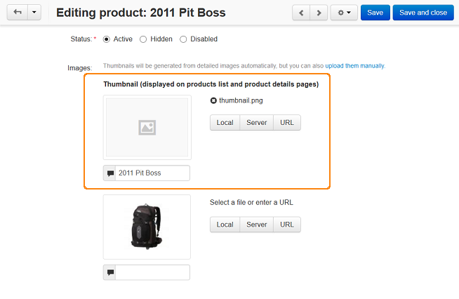

*************************
How To: Manage Thumbnails
*************************

By default the thumbnails for products are created automatically from the detailed images.

In order to upload the thumbnails manually:

1.   In the Administration panel, go to **Products → Products**.
2.   Select the product, for which you want to add a thumbnail and click on its name.
3.   In the **General** section next to the image of the product click the **upload them manually** link.

.. image:: img/thumbnails_01.png
    :align: center
    :alt: General tab

4.   Upload a file for the **Thumbnail** in the opened form.

The image can be either uploaded from a local computer or the server file system, or linked to a remote location where the required image is physically located. 

5. If necessary, enter the alternative text under the icon. It appears instead of the image when it isn't available. Providing alternative texts for images is good for SEO.

6.   Click the **Save** button.

To learn how to change the thumbnail size and appearance settings, please, refer to :doc:`the How To: Change the Image Size on the Storefront <../changing_attributes/change_image_size>` article.

.. note ::

	After changing these settings you will need to re-generate thumbnails. To do it, go to **Administration → Storage → Clean up generated thumbnails**.

.. note ::

    Detailed pictures are displayed in the viewing larger image window, created thumbnails are displayed on the product detail page. If you add additional images for the product, additional small thumbnails are created and displayed under the main image on the product detail page.

