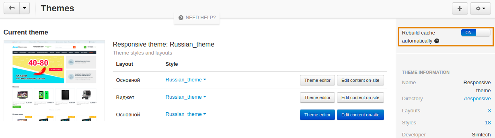

*****************************************
Changes in the Template Are Not Displayed
*****************************************

If you made changes to a template, but they are not displayed, please try clearing the template cache. To do it, open the Administration panel of your store, go to **Administration → Storage** and choose the **Clear cache** tab.

You can also enable the **Rebuild Cache Automatically** option. With this option enabled modified files are tracked in real time (including the files modified directly on server) and re-cached. To do it:

1. In the Administration panel, go to **Design → Themes**.
2. Find the **Rebuild Cache Automatically** option and enable it.

.. note::

    Block cache will be disabled. Store performance may be slightly affected. Recommended to disable on production. 
