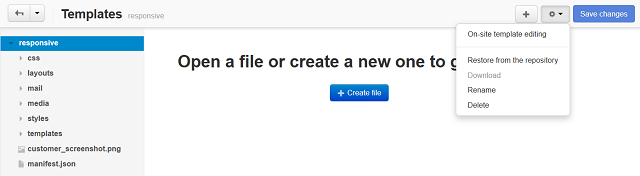

*********
Templates
*********

The **Design → Templates** section provides a facility to edit the source code of the theme files directly from a web browser.

.. note ::

	The File editor is based on Javascript. So, Javascript must be enabled in your web browser.

.. toctree::
    :maxdepth: 3
    :titlesonly:
    :glob:

    *

Controls
********

The editor includes a file explorer that is used to locate the elements inside the theme directory, and a number of controls to manage the files and folders.

Controls grouped under the gear button and the **+** button perform the following operations:

*	**On-site template editing** - Editing the storefront templates on the fly. When you choose this tab, the storefront appears in the separate window. Editable templates have an edit icon assigned to them. Hover the mouse point over the necessary icon to highlight the corresponding template or group of related templates, then click the name of the template you want to edit. The template source code will appear in the file editor. Edit the template and save your changes.
*	**Restore from the repository** - Restoring the original file from the theme directory.
*	**Download** - Saving the selected file on the computer.
*	**Rename** - Renaming the selected file or folder.
*	**Delete** - Deleting the selected file or folder.
*	**Create file** - Creating a new file.
*	**Create folder** - Creating a new folder.
*	**Upload file** - Uploading a file to the opened directory.

Learn more about the File editor `in the corresponding article <http://docs.cs-cart.com/4.4.x/developer_guide/tools/file_editor.html>`_.
