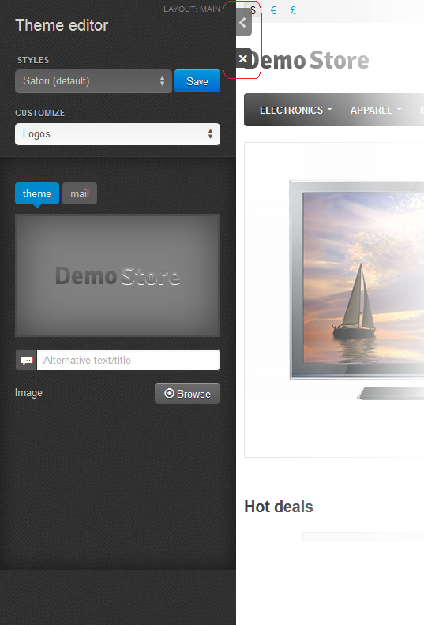
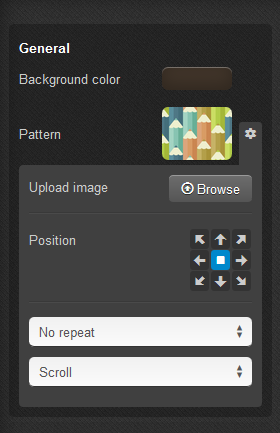

************
Theme Editor
************

In the **Theme editor** you can easily change the default style to your individual company one: change logo, color scheme, fonts, background settings.

To open the **Theme editor** panel, in the Administration panel go to the **Design → Themes** section and click the **Theme Editor** button near the desired layout.

You can hide the editor panel or close the **Theme editor** using the controls marked with red in the picture below.

With the help of the **Theme editor** you can create unlimited number of styles, clone and delete the existing styles (except the default one).

To change the style, choose the desired one from the drop-down list or clone one of them, rename and customize it according to your preferences, and click the **Save** button.

Your style will appear in the list of other available styles. Read how to customize a style further in this topic.

Customizing
***********

There are 6 groups of the theme customization:

*	**General** - Change the favicon and choose whether to round the corners or not.
*	**Logos** - Change the mail, theme, and gift certificate templates logos.
*	**Colors** - Set the color scheme and change colors for different theme elements (buttons, menu, etc.)
*	**Fonts** - Change the font style for different groups (headings, buttons, etc.)
*	**Backgrounds** - Background settings (color, gradient, image, etc.)
*	**Custom CSS** - Advanced style settings in CSS-format.

.. image:: img/theme_editor_01.png
    :align: center
    :alt: Customizing

General
-------

To change the favicon for the store, click **Browse** and choose a picture. Favicon size must be 16х16 px. The picture will appear near the button after applying changes. You can also click the **On/Off** button to define whether to round corners in the store or not.

.. important::

	You cannot upload a favicon for default styles. Create a new one first. To do it, click the **Save** button near the style name and type a new style name in the pop up window.

Logos
-----

Use this section to define the set of the store logos that are shown in the customer area, in the store invoices, and in the gift certificates.

To upload the logo image from a local computer, click the **Browse** button.

An alternative text describes the image and is shown when the image is missing or cannot be displayed. It is good practice to have an alternative text associated with the image as an additional SEO-wise opportunity.

.. important::

	You cannot upload logos for default styles. Create a new one first. To do it, click the **Save** button near the style name and type a new style name in the pop up window.

Colors
------

In this section you can see the list of colors for different theme elements. Click on the color corresponding to the particular element to change it.

Here you can either choose a color from the palette or enter new hexadecimal values (from #000000 for black to #FFFFFF for white) into corresponding text fields.

Click **Choose** in the same picker window when you are ready.

To reset changes, click the **Reset colors** button.

Fonts
-----

Here you can change the font style for different groups of elements: body, headings, links, price tag, buttons.

Use the drop-down lists to pick a font and it's size, and the buttons to the right to set the text to bold, italic, or underlined.

To reset changes, click the **Reset fonts** button.

Backgrounds
-----------

Use this section to define the settings of different background elements: general, top panel, header, content, footer.

You can change the background color of each element and see the applied changes on the storefront instantly. Click on the color corresponding to the particular element to change it.

Here you can either choose a color from the palette or enter new hexadecimal values (from #000000 for black to #FFFFFF for white) into corresponding text fields. Click **Choose** when you are ready.

For the **General** subsection, you can also set pattern as the background. Click the pattern preview to choose one from the list of given patterns. You can also click the gear icon and choose **Browse** to upload an image from your computer. The picture must not be larger than 200 kB.

.. important::

	You cannot upload patterns for default styles. Create a new one first. To do it, click the **Save** button near the style name and type a new style name in the pop up window.

With the help of pointers you can set the position of an image. Drop-down lists help you to define the picture display methods: whether to repeat it in different directions (to fill in the background) or not, and whether to scroll the image or leave it fixed while searching through the page.

For the header, top panel, footer, and content you can define the following settings:

*	**Gradient** (for the top panel, header, and footer) - Click on the color, to define the gradient. Here you can either choose a color from the palette or enter new hexadecimal values (from #000000 for black to #FFFFFF for white) into corresponding text fields. Click **Choose** when you are ready. You can try to choose different colors to form the gradient and see the result on the storefront to the right.
*	**Full width** - Click the **On/Off** button to define whether to spread the element to the full width of the page or not.
*	**Transparent** - Choose whether to make the background of an element transparent or not.

Custom CSS
----------

If you are familiar with CSS, use this section to customize some style elements.

Do not forget to click the **Save** button when you are ready to save changes in the theme.
