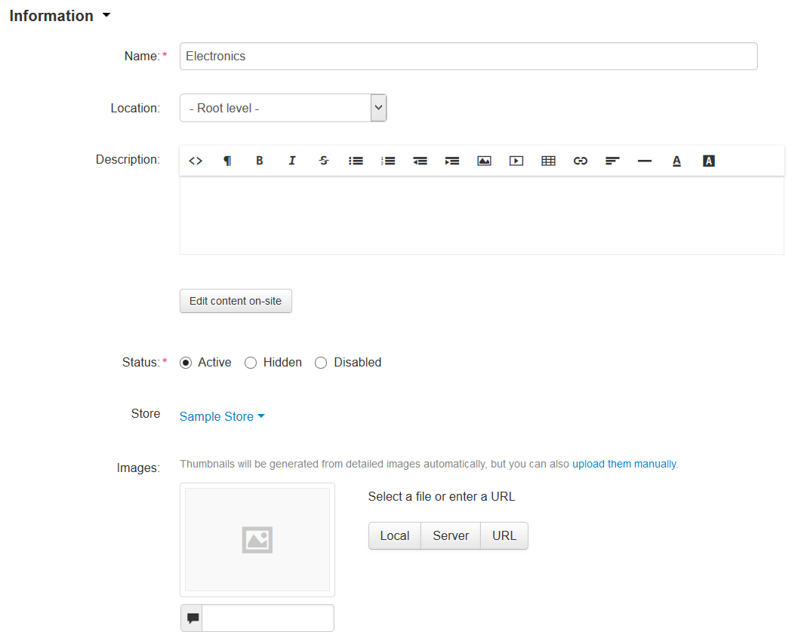
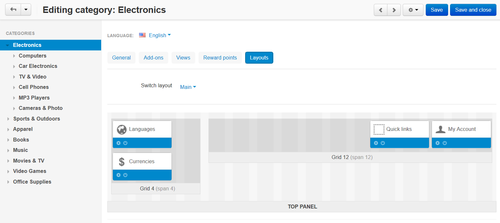

*******************
Category Properties
*******************

When you create or edit a category, your specify a number of properties. For convenience, properties are grouped under several tabs.

.. contents::
    :backlinks: none
    :local: 
    :depth: 1

=======
General
=======

-----------
Information
-----------

* **Name**—the name of the category as it appears on the storefront and in the Administration panel.

* **Location**—the position of the category in the category tree: a root category or a child category.

* **Description**—the description of the category as it appears on the storefront.

  The description appears on the category page under the category's name and helps visitors understand what kind of products they should expect to find in this category. An informative description is also good for SEO.

  The description can be either a plain text or a formatted HTML text. If you’re not familiar with HTML code, you can rely on the visual editor: you simply edit the description like a document, and the visual editor adds the HTML code automatically.

  .. hint::

      You can choose or disable the visual editor under **Settings → Appearance → Default WYSIWYG editor**.

* **Status**—the status of the category:

  * *Active*—the category is available on the storefront and appears on the list of categories.

  * *Disabled*—the category is not available on the storefront.

  * *Hidden*—the category does not appear on the storefront, but customers can access it via a direct link.

* **Store**—the storefront to which the category is assigned.

* **Images**—a large category image and its icon (thumbnail). Supported formats are JPEG, GIF, and PNG. The maximum size of an uploaded image depends on your server configuration. As a rule, it should not exceed 2 MB.

  .. note::

      By default, thumbnails are generated from detailed images automatically. However, you can upload thumbnails manually.

  The text field below the image lets you describe the image in words. Technically, it is the text that you enter appears inside the ``alt=""`` and ``title=""`` attributes of the ```` HTML tag. This text is shown when the image is missing or cannot be displayed. It is good practice to have an alternative text associated with the image, for SEO purposes.



---------
Meta Data
---------

* **Page title**—the content of the ``<title></title>`` container: the title of the category page on the storefront, which is displayed in the web browser when somebody is viewing the page. If you don’t specify a value manually, it will be generated automatically.

* **META description**—the content of the ``description`` meta-tag: a brief description of the category.

* **META keywords**—the content of the ``keywords`` meta-tag: a list of search keywords that appear on the category page.

.. note::

    Instructions on how to best use the meta tags may vary depending on the search engine.

------------
Availability
------------

* **User groups**—the :doc:`user groups </user_guide/users/user_groups/index>` that can access the category:

  * **All**—all users.

  * **Guest**—unregistered users or users who haven't signed in yet.

  * **Registered user**—users who have signed into their accounts.

  * **Apply to all subcategories**—apply the same rules to all subcategories of this category.

* **Position**—the position of the category relatively to the other categories of the same level. If no category positions are defined, categories are sorted alphabetically.

* **Creation date**—the date when the category was added to the catalog.

=======
Layouts
=======

This tab duplicates the :doc:`global layout </user_guide/look_and_feel/layouts/index>` of the category page from **Design → Layouts** section of the Administration panel.

By using this tab, you can enable or disable some blocks, changing the look of the category page that way. Any changes you make here will not affect the pages of other categories.

.. note::

    This tab is displayed only when you edit an existing category, not when you create a new one.



=======
Add-ons
=======

---
SEO
---

* **SEO name**—the value to which the standard URL will be changed. This property is added by the :doc:`SEO </user_guide/addons/seo/index>` add-on.

----------------
Age verification
----------------

.. note::

    This is a part of the :doc:`Age verification </user_guide/addons/age_verification/index>` add-on.

* **Age verification**—if you tick this checkbox, the access to the category will be limited by the customer's age.

* **Age limit**—the minimum age for accessing the category and the products in this category.

* **Warning message**—the message to be displayed, if the customer does not qualify for accessing the category.

--------------------
Comments and Reviews
--------------------
   
* **Reviews**—choose whether to allow comments, reviews, or both for this category. This property is added by the :doc:`Comments and reviews </user_guide/addons/comments_and_reviews/index>` add-on.

=====
Views 
=====

* **Product details view**—the template of the pages of all products that belong to this category.

* **Use custom view**—if you tick this checkbox, you'll be able to configure the looks of the category page.

* **Product columns**—the number of columns that the products the category are displayed in. This property affects only the *Grid* view.

* **Available views**—select the product list layouts that customers should be able to choose from when viewing the category.

* **Default category view**—select the default layout of the product list in this category.

=============
Reward Points
=============

The number of reward points that customers receive for buying products from this category.

* **Override global point value for all products in this category**—if you tick this checkbox, the values below will take priority over the global values defined in :doc:`Marketing → Reward points </user_guide/addons/reward_points/index>`.

* **User group**—the :doc:`user group </user_guide/users/user_groups/index>`, members of which will get reward points for buying products from this category.

* **Amount**—the number of reward points to be granted to a user group member for buying a product from this category.

* **Amount type**—the absolute number of points or percentage-based value calculated in the following manner: the product cost is divided into 100, and the result is multiplied by the value in the field.

=======
Reviews
=======

The list of customers' reviews of the category. You can add your own reviews or edit existing ones.

.. note::

    This tab requires the :doc:`Comments and reviews </user_guide/addons/comments_and_reviews/index>` add-on to be active. This tab appears only when communication and/or rating is enabled for the category on the **Add-ons** tab.

.. image:: img/reviews.png
    :align: center
    :alt: Enabling reviews and comments for a category.
