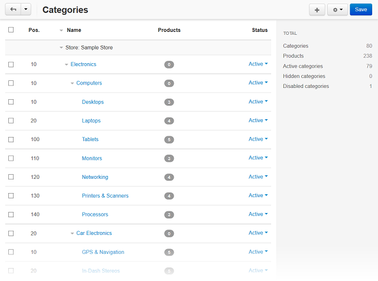

**********
Categories
**********

The two key concepts to describe the cataloguing in CS-Cart are the *product* and the *category of products*, or simply the *category*.

Finding a right product in a web store becomes much easier if the products in the catalog are categorized, i.e. are sensibly arranged into groups of related products, or categories. Each product category can include an unlimited number of child categories which, in return, can include own child categories.

Child categories are referred to as *sub-categories* while the categories that do not have parent categories, i.e. categories of the highest level, are called *root categories*. The system of categories enables you to build the catalog in the way of a tree with multiple branches, making the navigation structured, intuitive, and clear.

.. note::

	The nature of using categories in a multiple-store environment is described in `Understanding multi-store functionality <http://docs.cs-cart.com/4.4.x/user_guide/stores/index.html>`_.

.. important::

	Individual products cannot appear outside a product category, so every product that you have in your catalog must be assigned to at least one category.

Actions on categories
*********************

The store administrator can carry out the following actions on the categories:

*	Add individual categories (the **+** button) or several categories at a time (the **Bulk category addition** link under the gear button).
*	Change attributes per category or simultaneously for several categories:

	*	To change attributes per category, hover the mouse pointer over a category and click the appearing gear button. Choose **Edit**.
	*	To change attributes simultaneously for several categories, tick the checkboxes of the desired categories, click the gear button in the upper right part of the page, and choose **Edit selected**.

*	Delete categories:

	*	To delete a particular category, hover the mouse pointer over this category and click the appearing gear button. Choose **Delete**.
	*	To delete several categories simultaneously, tick the checkboxes of the desired categories, click the gear button in the upper right part of the page, and choose **Delete selected**.

.. warning::

	Be careful when deleting a category! Child categories and the products under the category will be deleted automatically.

In this section
***************

.. toctree::
    :maxdepth: 2
    :titlesonly:
    :glob:

    *
