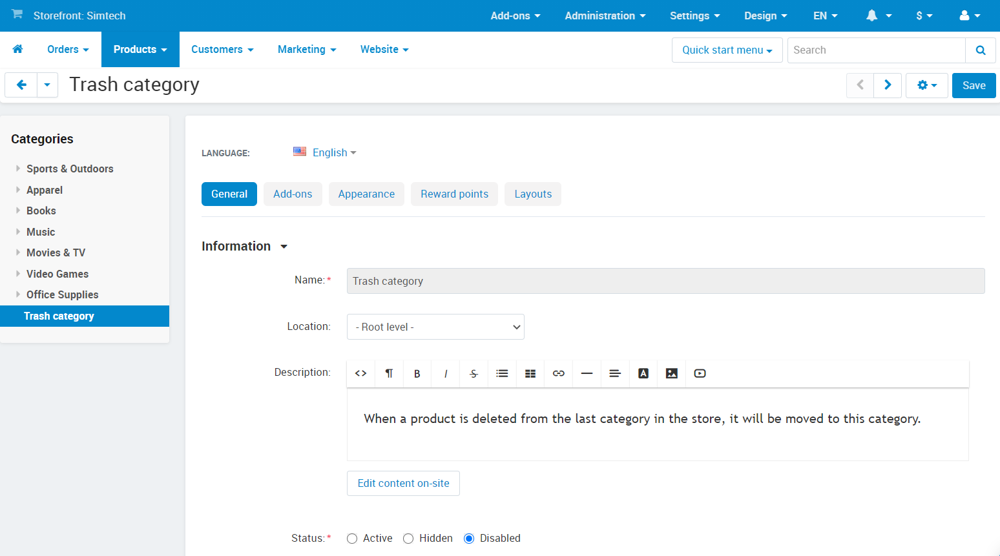

**************
Trash Category
**************

.. warning::

    The **Trash category** doesn't exist in Multi-Vendor. When you delete a category in Multi-Vendor, the products and subcategories will simply be deleted.

Products and categories CS-Cart are characterized by belonging to a specific storefront.

Each storefront has a **Trash category** that can't be renamed; it is created automatically when a category is deleted. The **Trash category** is located at the end of the list of categories and is *Disabled* by default to prevent products from this category from appearing on the storefront.

If you delete a category, all products inside this category that are not assigned to other categories on this storefront will be moved to the **Trash category**.

.. warning::

    If you delete the **Trash category**, then all the products assigned to it will be deleted permanently.
