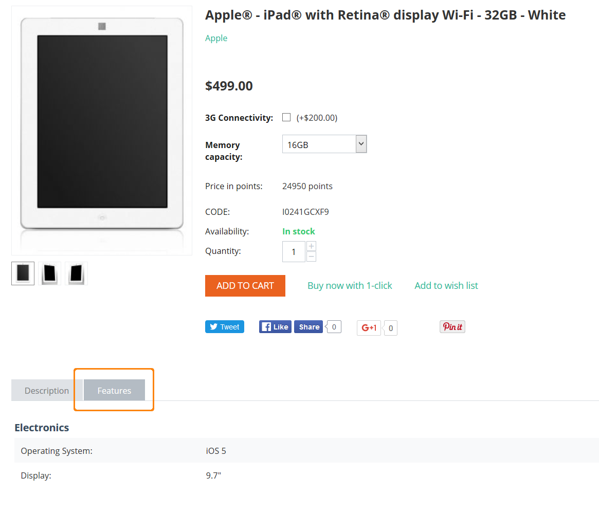

************************************
Feature and Feature Group Attributes
************************************



=======
General
=======

* **Name**—the name of the feature as it appears on the storefront and in the Administration panel.

* **Store**—the store to which the product feature originally belongs.

* **Feature code**—the code to identify the feature.

* **Position**—the position of the feature relatively to the position of the other features in the list.

* **Description**—the description of the feature. 

  The description appears on the storefront, if the customer clicks the question sign (**?**) next to the feature name on the **Features** tab.

* **Type**—the type of the field for the feature: 

  * **Check box**: can be *Single* or *Multiple*.

  * **Select box**: can be *Text*, *Number*, or *Brand/Manufacturer*.

    .. note::

       Selecting the *Brand/Manufacturer* type allows you you to extend feature values with several extra attributes like a separate image, description, page title, META description, and keywords.  

  * **Others**: can be *Text*, *Number*, or *Date*.
 
* **Group**—the group that the product feature belongs to. If you assign the feature to a group, the next two attributes will apply to the whole group, not just the feature.

  .. warning::

      Deleting a group will also delete all the features that belong to the group. 
 
* **Show on the Features tab**—if you tick this checkbox, the product feature will be displayed on the product details page as a separate tab.

* **Show in product header**—if you tick this checkbox, the feature will be shown under the product header.

* **Show in product list**—if you tick this checkbox, the feature will appear among the other product details in the product list on the storefront.
 
* **Prefix**—what you enter here will appear before the feature value.

* **Suffix**—what you enter here will appear after the feature value.

========
Variants
========

Features of *Check box: Multiple* or *Select box* type can have variants, that the administrators can choose from when editing the product. These variants can be edited on the **Variants** tab.

* **Pos.**—the position of the feature variant relatively to other variants in the list.

* **Variant**—the value of the feature variant.

The following attributes of feature variants are available only for the *Brand/Manufacturer* feature type:

* **Image**—the image to illustrate the feature variant.

  An image can be either uploaded from a local computer or the server file system, or by specifying a link to the image. Only JPEG, GIF, and PNG images are supported. The maximum size of an uploaded image depends on your server configuration. As a rule, it should not exceed 2 MB.

  An alternative text describes an image in words. Technically, the text that you enter appears inside the ``alt=""`` and ``title=""`` attributes of the ```` HTML tag. The text is shown when the image is missing or cannot be displayed. Using alternative text associated with the image is good for `SEO <https://en.wikipedia.org/wiki/Search_engine_optimization>`_.

* **Description**—the description of the feature variant as it appears on the storefront.

  The description can be either a plain text or a formatted HTML text. If you are not familiar with HTML, you can add a formatted description with the built-in WYSIWYG HTML editor.

* **Page title**—the title of the feature variant page on the storefront, which is displayed in the web browser when somebody is viewing the page. Required for SEO purposes.

* **URL**—the URL with which you want to replace the current URL. Leave empty if you don't want to replace the URL.

* **META description**—the content of the HTML meta tag describing the feature variant. Required for SEO purposes. 

* **META keywords**—the content of the HTML tag containing a list of search keywords for the feature variant. Required for SEO purposes.

* **SEO name**—the value to which the standard URL will be changed.

==========
Categories
==========

List of categories which products may utilize this feature. If no category is specified, the feature will apply to all categories.

=====
Share
=====

The list of stores that share this product feature. `Learn more about sharing objects. <http://docs.cs-cart.com/4.3.x/user_guide/stores/sharing.html>`_
