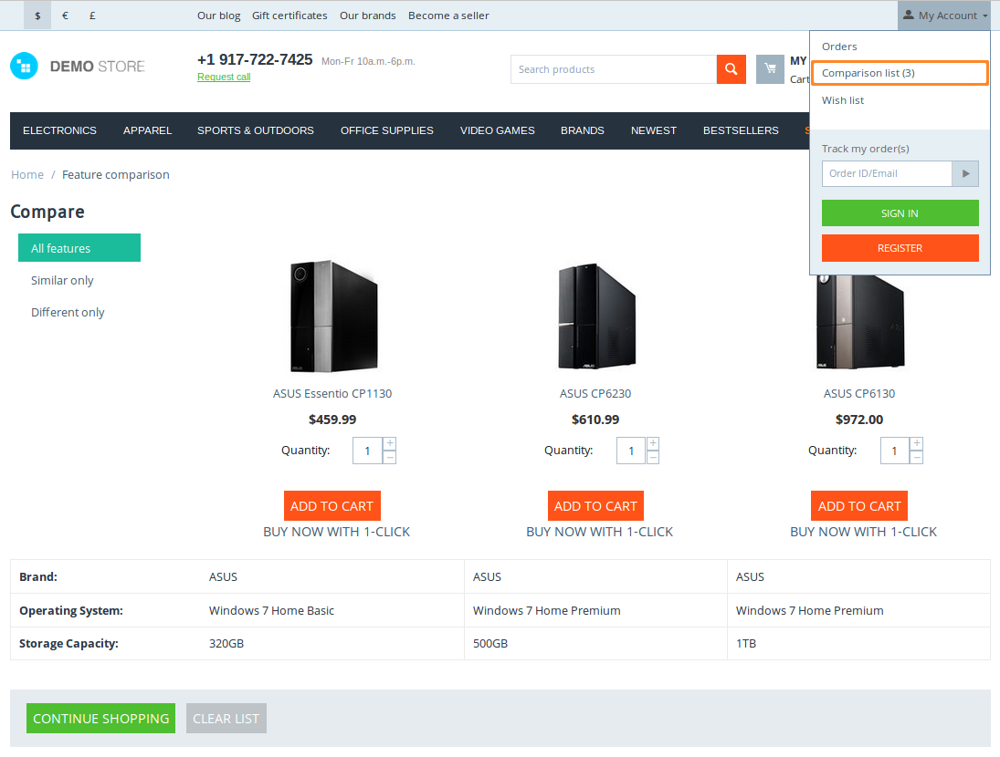
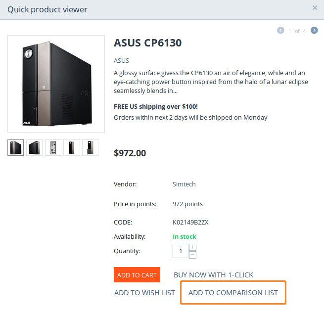
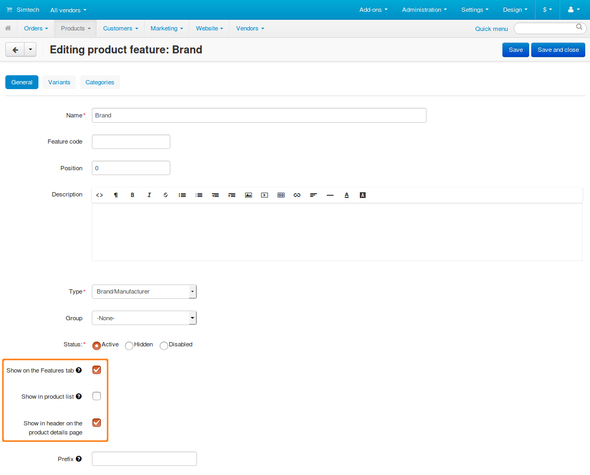

*********************************
How To: Enable Feature Comparison
*********************************

CS-Cart/Multi-Vendor allows customers to compare the features of products. Customers add products to comparison list, and the features of those products are displayed in a table.
This article describes how you can enable this behavior and determine what features will appear in comparison list.

===========================================
Step 1. Allow Customers to Compare Products
===========================================

First we need to make sure that customers are allowed to compare products. To do that:

1.1 Open the Administration panel of your store and go to **Settings → General**.

1.2. Make sure that the **Allow customers to compare products** checkbox is ticked.

.. image:: img/allow_product_comparison.png
    :align: center
    :alt: Go to Settings → General to make sure that product comparison is allowed.

By default, the checkbox is ticked already. It means that every product in your store will have an **Add to comparison list** button. It will appear both on product pages and in **Quick view** pop-up windows.

================================================
Step 2. Make a Feature Appear in Comparison List
================================================

Not all features appear in comparison list. It depends on the properties of a feature. To make a feature appear in comparison list, follow these instructions:

2.1. Go to **Products → Features**.

2.2. Click on the name of the feature to open the feature editing page.

2.3. Make sure that the feature has at least one of these checkboxes ticked:

* **Show on the Features tab**
* **Show in product list**
* **Show in header on the product details page**

.. important::

    If any of these checkboxes is ticked, the feature will appear in comparison list.

4. Click **Save**.

