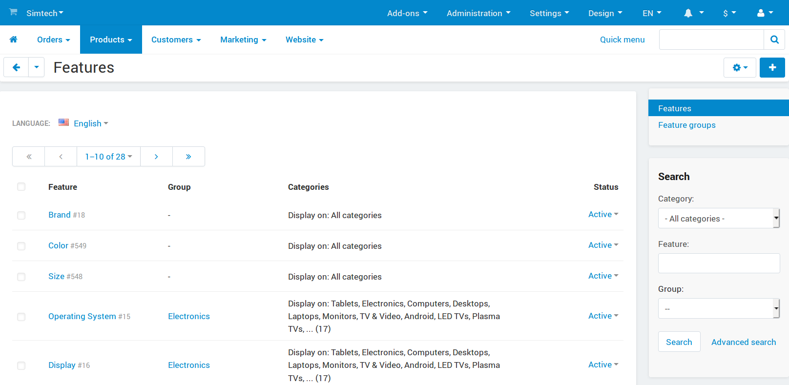

********
Features
********

**Features** are additional product fields. You can use them to add information that is specific to the products you sell. For example, if you sell printed books, you can add a field for ISBN; if you sell music, you can add a field for the audio format, etc.

The **Products → Features** section contains a list of all product features that are available in your store. Optionally, you can arrange features into groups and then edit the settings of the whole group instead of editing every single feature.

.. hint::

    Use the menu on the right to switch between the lists of features and feature groups.

.. note ::

    You can use features to filter products in the advanced search in the **Products → Products** section.

In this section
***************

.. toctree::
    :maxdepth: 1
    :glob:

    feature_attributes
    product_features
    manufacturer
    feature_comparison
